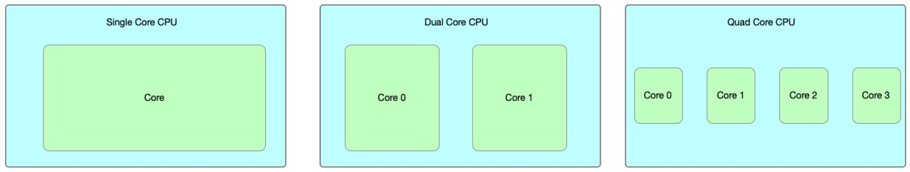
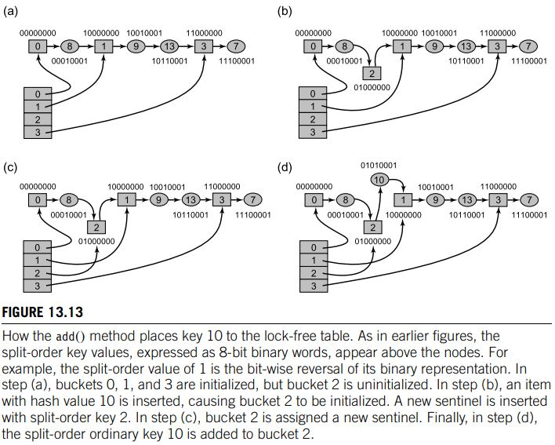

- [Module 1](#module-1)
    + [Architectures Overview](#architectures-overview)
    + [Basic Architecture (Von Neumann)](#basic-architecture--von-neumann-)
    + [Computer Program Basics](#computer-program-basics)
    + [Multi-Core Chips](#multi-core-chips)
    + [Programming on Multi-cores](#programming-on-multi-cores)
    + [Concurrency vs Parallelism](#concurrency-vs-parallelism)
- [Module 2](#module-2)
  * [General Parallel Computing Terminology](#general-parallel-computing-terminology)
  * [Potential Benefits, Limits and Costs of Parallel Programming](#potential-benefits--limits-and-costs-of-parallel-programming)
  * [Parallel Computer Memory Architecture](#parallel-computer-memory-architecture)
  * [Shared Memory System](#shared-memory-system)
    + [Uniform Memory Access (UMA) System](#uniform-memory-access--uma--system)
    + [Symmetric Multiprocessing (SMP) System](#symmetric-multiprocessing--smp--system)
    + [System Bus (for SMP architecture)](#system-bus--for-smp-architecture-)
  * [Program Execution](#program-execution)
    + [Process](#process)
    + [Threads](#threads)
    + [Processes and Processors](#processes-and-processors)
    + [Simultaneous Multi-threading (SMT) / Hyperthreading](#simultaneous-multi-threading--smt----hyperthreading)
    + [Logical / Hardware Processors](#logical---hardware-processors)
    + [Structuring Parallel Programs](#structuring-parallel-programs)
    + [Task Decomposition and Granularity](#task-decomposition-and-granularity)
  * [Improving Data Access Performance](#improving-data-access-performance)
    + [Processors and Memory](#processors-and-memory)
    + [Cache](#cache)
    + [Principle of Locality](#principle-of-locality)
    + [Cache Levels](#cache-levels)
    + [Cache Hit / Miss](#cache-hit---miss)
    + [Cache Coherence](#cache-coherence)
    + [Race Conditions](#race-conditions)
    + [Synchronization using `atomics`](#synchronization-using--atomics-)
    + [Issues with Atomic operations](#issues-with-atomic-operations)
    + [Instruction Level Parallelism (ILP)](#instruction-level-parallelism--ilp-)
- [Module 3](#module-3)
  * [Admdahl's Law](#admdahl-s-law)
  * [Locks](#locks)
  * [Formal Properties in asynchronous computation](#formal-properties-in-asynchronous-computation)
  * [Formal Properties of a good Critical Section](#formal-properties-of-a-good-critical-section)
    + [`LockOne` 2-thread lock algorithm (not good)](#-lockone--2-thread-lock-algorithm--not-good-)
    + [`LockTwo` 2-thread lock algorithm (not good)](#-locktwo--2-thread-lock-algorithm--not-good-)
    + [`PetersonLock` 2-thread lock algorithm (good)](#-petersonlock--2-thread-lock-algorithm--good-)
    + [LiveLock](#livelock)
    + [Fairness](#fairness)
    + [Bakery Algorithm `BakeryLock` n-thread lock algorithm; `O(n)` space](#bakery-algorithm--bakerylock--n-thread-lock-algorithm---o-n---space)
    + [Spin Locks, Contention](#spin-locks--contention)
    + [Practical Lock Implementation](#practical-lock-implementation)
    + [Test-And-Set Locks (`TASLock`) n-thread lock algorithm; O(1) space](#test-and-set-locks---taslock---n-thread-lock-algorithm--o-1--space)
    + [Test-And-Test-And-Set Lock (`TTASLock`) n-thread lock algorithm; O(1) space](#test-and-test-and-set-lock---ttaslock---n-thread-lock-algorithm--o-1--space)
    + [Exponential Backoff Lock (`BackoffLock`) n-thread lock algorithm; O(1) space](#exponential-backoff-lock---backofflock---n-thread-lock-algorithm--o-1--space)
    + [Queue Locks (`ALock`, `AndersonLock`) n-thread lock algorithm; O(N) space](#queue-locks---alock----andersonlock---n-thread-lock-algorithm--o-n--space)
    + [LL Locks (`CLHLock`) n-thread lock algorithm; O(L+N) space](#ll-locks---clhlock---n-thread-lock-algorithm--o-l-n--space)
    + [LL Locks (`MCSLock`) n-thread lock algorithm; O(L+N) space](#ll-locks---mcslock---n-thread-lock-algorithm--o-l-n--space)
- [Module 4](#module-4)
  * [Concurrent Data Structures](#concurrent-data-structures)
    + [Non-blocking Algorithms](#non-blocking-algorithms)
  * [Linked-List (concurrent)](#linked-list--concurrent-)
  * [Coarse-grained synchronization](#coarse-grained-synchronization)
    + [Linked-List (coarse-grained)](#linked-list--coarse-grained-)
  * [Fine-grained synchronization](#fine-grained-synchronization)
    + [Linked-List (fine-grained)](#linked-list--fine-grained-)
  * [Optimistic synchronization](#optimistic-synchronization)
  * [Condition Variables](#condition-variables)
    + [in go](#in-go)
    + [in java](#in-java)
  * [Semaphore](#semaphore)
    + [in go](#in-go-1)
    + [in java](#in-java-1)
- [Module 4 (continued...)](#module-4--continued-)
  * [Lazy synchronization](#lazy-synchronization)
    + [Traffic Jam](#traffic-jam)
  * [Nonblocking Synchronization (Lock-free)](#nonblocking-synchronization--lock-free-)
- [Module 5](#module-5)
  * [Pool data structure](#pool-data-structure)
    + [Queues & Stacks](#queues---stacks)
    + [Bounded vs Unbounded implementation](#bounded-vs-unbounded-implementation)
    + [Blocking vs Non-Blocking](#blocking-vs-non-blocking)
    + [Queue: Concurrency](#queue--concurrency)
    + [Queue: concurrent blocking implementation](#queue--concurrent-blocking-implementation)
      - [Enqueue](#enqueue)
      - [Dequeue](#dequeue)
    + [implementation of bounded queue](#implementation-of-bounded-queue)
    + [Queue: concurrent unbounded queue](#queue--concurrent-unbounded-queue)
    + [Queue: concurrent lock-free queue (non-blocking)](#queue--concurrent-lock-free-queue--non-blocking-)
    + [implementation of unbounded lock-free queue (non-blocking)](#implementation-of-unbounded-lock-free-queue--non-blocking-)
    + [enqueue](#enqueue)
    + [dequeue](#dequeue)
  * [Concurrent Stack (lock-free)](#concurrent-stack--lock-free-)
    + [implementation](#implementation)
      - [push()](#push--)
      - [pop()](#pop--)
  * [Concurrent Hash Table](#concurrent-hash-table)
    + [Closed-address hash set (java)](#closed-address-hash-set--java-)
      - [Coarse-grained Hash Table (closed-address)](#coarse-grained-hash-table--closed-address-)
      - [Fine-grained Hash Table (striped, closed-address)](#fine-grained-hash-table--striped--closed-address-)
      - [Striped Hash Table (close-address)](#striped-hash-table--close-address-)
    + [Refinable Hash Table](#refinable-hash-table)
    + [Lock-free Hash Table (Recursive split-ordering)](#lock-free-hash-table--recursive-split-ordering-)
    + [Concurrent Hash Table (open-address)](#concurrent-hash-table--open-address-)
    + [Concurrent Hash Table (summary)](#concurrent-hash-table--summary-)

<small><i><a href='http://ecotrust-canada.github.io/markdown-toc/'>Table of contents generated with markdown-toc</a></i></small>


# Module 1

---

### Architectures Overview

__Modern architectures resemble Von Neumann architecture__ (as opposed Harvard Architecture)

Two main architectures people talk about: __Von Nuemann__ and __Harvard Architecture__


| Characteristic   |     __Von Neumann__      |  __Harvard__ |
|----------|-------------|------|
| physical address |  one physical address for accessing, storing both data, instructions | two physical addresses for accessing and storing both data, instructions (physically separate addresses) |
| buses / signal paths |    uses a single (common) path (bus) for transfer of data, instructions   |   uses separate buses for transfer of data, instructions |
| cycles |    requires 2 clock cycles for executing instruction (fetch, execute)   |   only requires 1 clock cycle to execute instruction (fetch and execute) |
| cost |    cheap   |   more expensive |
| access to CPU |    CPU can't read/write data and access instructions at same time   |   CPU easily read/writes data and accesses instructions at same time |
| uses |    small computers, personal computers (general purepose PC)   |   signal processing, micro controllers (embedded systems) |
| Hardware requirements |    requires lesser architecture   |   requires more hardware |
| Space requirements |    requires less space (data + instructions stored in same place)   |   requires more space (data, instructions stored separately) |
| usage of space |    efficient   |   less efficient |
| execution speed |    slower   |   faster |
| controlling |    simpler   |   more complex |


---

### Basic Architecture (Von Neumann)


__Memory__: a collection of locations, capable of storing instructions or data
* Every location consists of an __address__, which is used to access the location, and the contents of the location.
* A computer can contain various types of memory components (registers, caches, RAM, secondary memory (i.e., hard drive) etc.)
  * registers --> secondary memory (faster access, less storage --> slower access, more storage)

__Central Processing Unit (CPU)__: controller of a computer and is composed of many different parts. Two main parts:
* __Control Unit (CU)__: responsible for deciding which instruction in a program should be executed. (the boss) 
* __Arithmetic and Logic Unit (ALU)__: responsible for executing the actual instructions. (the worker) 

__Input Devices__: devices that send information to a computer for processing (e.g., keyboard, mouse, etc.)

__Output Devices__: devices that display/use the results of processing of tasks by the computer. (e.g., monitor, printer, speakers) 

---

### Computer Program Basics


__Sequential Program__: 
* series of textual statements specifying the order of execution
* each statement is converted to an instruction by CPU.
* programs may be deterministic (for given input, same ordered statements are executed) or non-deterministic
  * note: some people use the word deterministic to mean deterministic results (same results for a given input)

Speed of a single processor is driven by __transistor density__ on the CPU chip
* as the size of transistors goes down, their speed can be increased, leading to overal speed of the integrated chip increasing (i.e. increasing clock rate)

__Moore's Law__:
* computing power doubles every two years
* density of transistors approximately doubles every two years

~Three Problems are encroaching on progress!
1. __<span style="color:red">Heat</span>__. As transistor density goes up, power consumption per volume increases, heat generation per volume increases, air cooling no longer becomes sufficient to keep devices cool 
2. __<span style="color:red">Structural Integrity (fragile)</span>__. As transistor density goes up, transistor size is going down, transistor fragility goes up. 
3. __<span style="color:red">Production Issues</span>__. As transistor density goes up, quantum tunneling and other production issues occur, production speed goes down. 

Speed of integrated circuit is reaching a limit of ~3.0-3.7 GHz. With overclocking, 4.0-5.0 GHz.

---

### Multi-Core Chips

__Multi-Core Chip Design__: can continue to increase transistor density by having multiple and lower clocked processors on one CPU chip

__Core__: "processor". synonymous with CPU

__Mult-Core__: "multiprocessor". more than one core on integrated circuit


> ex: single-core processor. multi-core processor. multi-core processor.

Intel's newest processors (January 2022) used in i9-12900K core, i7-12700K core, ... have
* 8-6 performance CPU cores (higher clock rates); physically large
* 8-4 efficient CPU cores (lower clock rates); physically small

### Programming on Multi-cores

Programmer needs to break the problem into discrete _tasks_, where each task can run on separate core.

__Task__:
* a unit of computational work. simply put, work is a series of program statements.
* tasks can be run (potentially) in parallel, but this is not a requirement

__Parallel Program__:
* solves a problem that consists of multiple tasks running on multiple processors simultaneously


> e.g. we took 1 problem and broke it down into 4 tasks, where each task has a series of instructions

---

### Concurrency vs Parallelism

Both concepts refer to a notion of executing a task at the same time.

__Concurrency__: 
* dealing with tasks that are __logically__ happening simultaneously.
* Two tasks are concurrent if they can be logically active at the same point in time

__Parallelism__:
* dealing with tasks that are __physically__ happening simultaneously

_Concurrency_ provides a way to structure a solution to a problem that may (not necessarily) have tasks executed in parallel!

From: https://freecontent.manning.com/concurrency-vs-parallelism/

__Concurrency__:
* is about multiple tasks which start, run, and complete in overlapping time periods, in no specific order.

__Parallelism__:
* is about multiple tasks or subtasks of the same task that literally run at the same time on a hardware with multiple computing resources like multi-core processor. As you can see, concurrency and parallelism are similar but not identical.

__Concurrency__ is a semantic property of a program or system. Concurrency is when multiple tasks are in progress for overlapping periods of time. Note, here we are not talking about the actual execution of the tasks, but the design of the system – that the tasks are order-independent. So, concurrency is a conceptual property of a program or a system, it’s more about how the program or system has been designed.

Imagine that one cook is chopping salad while occasionally stirring the soup on the stove. He has to stop chopping, check the stove top, and then start chopping again, and repeat this process until everything is done.


As you can see, we only have one processing resource here, the chef, and his concurrency is mostly related to logistics; without concurrency, the chef has to wait until the soup on the stove is ready to chop the salad.

__Parallelism__ is an implementation property. Parallelism is literally the simultaneous physical execution of tasks at runtime, and it requires hardware with multiple computing resources. It resides on the hardware layer.

Back in the kitchen, now we have two chefs, one who can do stirring and one who can chop the salad. We’ve divided the work by having another processing resource, another chef.


Parallelism is a subclass of concurrency: before you can do several tasks at once, you have to manage several tasks first.

The essence of the relationship between concurrency and parallelism is that concurrent computations can be parallelized without changing the correctness of the result, but concurrency itself does not imply parallelism. Furthermore, parallelism does not imply concurrency; it is often possible for an optimizer to take programs with no semantic concurrency and break them down into parallel components via such techniques as pipeline processing, wide vector SIMD operations, or divide and conquer.

As Rob Pike pointed out “Concurrency is about dealing with lots of things at once. Parallelism is about doing lots of things at once.” In a single-core CPU, you can have concurrency but not parallelism. But both go beyond the traditional sequential model in which things happen one at a time.

To get more idea about the distinction between concurrency and parallelism, consider the following points:

- _An application can be concurrent but not parallel_, which means that it processes more than one task at the same time, but no two tasks are executing at the same time instant.
- _An application can be parallel but not concurrent_, which means that it processes multiple sub-tasks of a single task at the same time.
- _An application can be neither parallel nor concurrent_, which means that it processes one task at a time, sequentially, and the task is never broken into subtasks.
- _An application can be both parallel and concurrent_, which means that it processes multiple tasks or subtasks of a single task concurrently at the same time (executing them in parallel)

Imagine you have a program that inserts values into a hash table. If you spread the insert operation between multiple cores, that’s parallelism. But coordinating access to the hash table is concurrency.

---


__NOTE__: each parallel program should outperform the single processor concurrent and sequential program!

---

# Module 2

---

## General Parallel Computing Terminology

__CPU__: Contemporary CPUs consist of one or more cores - a distinct execution unit with its own instruction stream.
* Cores with a CPU may be organized into one or more sockets - each socket with its own distinct memory.
  * When a CPU consists of two or more sockets, usually hardware infrastructure supports memory sharing across sockets.

__Node__: A standalone "computer in a box." 
* Usually comprised of multiple CPUs/processors/cores, memory, network interfaces, etc.
* Nodes are networked together to comprise a supercomputer.

__Task__: A logically discrete section of computational work.
* A task is typically a program or program-like set of instructions that is executed by a processor.
* A parallel program consists of multiple tasks running on multiple processors.

__Pipelining__: Breaking a task into steps performed by different processor units, with inputs streaming through, much like an assembly line; a type of parallel computing.

__Shared Memory__: a computer architecture where all processors have direct access to common physical memory.
* In a programming sense, it describes a model where parallel tasks all have the same "picture" of memory and can directly address and access the same logical memory locations regardless of where the physical memory actually exists.

__Symmetric Multi-Processor (SMP)__: Shared memory hardware architecture where multiple processors share a single address space and have equal access to all resources - memory, disk, etc.

__Distributed Memory__: in hardware, refers to network based memory access for physical memory that is not common.
* As a programming model, tasks can only logically "see" local machine memory and must use communications to access memory on other machines where other tasks are executing.

__Communications__: Parallel tasks typically need to exchange data.
* There are several ways this can be accomplished, such as through a shared memory bus or over a network.

__Synchronization__: the coordination of parallel tasks in real time, very often associated with communications.
* Synchronization usually involves waiting by at least one task, and can therefore cause a parallel application's wall clock execution time to increase.

__Computational Granularity__: in parallel computing, granularity is a quantitative or qualitative measure of the ratio of computation to communication.
* __Coarse__: relatively large amounts of computational work are done between communication events
* __Fine__: relatively small amounts of computational work are done between communication events

__Observed Speedup__: Observed speedup of a code which has been parallelized, defined as:
```
        wall-clock time of serial execution
        -----------------------------------
        wall-clock time of parallel execution
```
One of the simplest and most widely used indicators for a parallel program's performance.

__Parallel Overhead__: required execution time that is unique to parallel tasks, as opposed to that for doing useful work.
Parallel overhead can include factors such as:
* Task start-up time
* Synchronizations
* Data communications
* Software overhead imposed by parallel languages, libraries, operating system, etc.
* Task termination time

__Massively Parallel__:
* Refers to the hardware that comprises a given parallel system - having many processing elements. The meaning of "many" keeps increasing, but currently, the largest parallel * computers are comprised of processing elements numbering in the hundreds of thousands to millions.

__Embarrassingly (IDEALY) Parallel__:
* Solving many similar, but independent tasks simultaneously; little to no need for coordination between the tasks.

__Scalability__: Refers to a parallel system's (hardware and/or software) ability to demonstrate a proportionate increase in parallel speedup with the addition of more resources. Factors that contribute to scalability include:
* Hardware - particularly memory-cpu bandwidths and network communication properties
* Application algorithm
* Parallel overhead related
* Characteristics of your specific application

## Potential Benefits, Limits and Costs of Parallel Programming

__Complexity__: 
* In general, parallel applications are more complex than corresponding serial applications. Not only do you have multiple instruction streams executing at the same time, but you also have data flowing between them.
* The costs of complexity are measured in programmer time in virtually every aspect of the software development cycle:
  * Design
  * Coding
  * Debugging
  * Tuning
  * Maintenance
* _Adhering to "good" software development practices is essential when developing  parallel applications._

__Portability__: 
* Thanks to standardization in several APIs, such as MPI, OpenMP and POSIX threads, portability issues with parallel programs are not as serious as in years  past. However...
* All of the usual portability issues associated with serial programs apply to parallel programs. For example, if you use vendor "enhancements" to Fortran, C or C++, portability will be a problem.
* Even though standards exist for several APIs, implementations will differ in a number of details, sometimes to the point of requiring code modifications in order to effect portability.
* Operating systems can play a key role in code portability issues.
* Hardware architectures are characteristically highly variable and can affect portability.

__Resource Requirements__:
* The primary intent of parallel programming is to decrease execution wall clock time, however in order to accomplish this, more CPU time is required. For example, a parallel code that runs in 1 hour on 8 processors actually uses 8 hours of CPU time.
* The amount of memory required can be greater for parallel codes than serial codes, due to the need to replicate data and for overheads associated with parallel support libraries and subsystems.
* For short running parallel programs, there can actually be a decrease in performance compared to a similar serial implementation. The overhead costs associated with setting up the parallel environment, task creation, communications and task termination can comprise a significant portion of the total execution time for short runs.

__Scalability__:
Two types of scaling based on time to solution: strong scaling and weak scaling.

* __Strong scaling (Amdahl)__: 
  * The total problem size stays fixed as more processors are added.
  * Goal is to run the same problem size faster
  * Perfect scaling means problem is solved in 1/P time (compared to serial)

* __Weak scaling (Gustafson):__
  * The problem size per processor stays fixed as more processors are added. The total problem size is proportional to the number of processors used.
  * Goal is to run larger problem in same amount of time
  * Perfect scaling means problem Px runs in same time as single processor run

* The ability of a parallel program's performance to scale is a result of a number of interrelated factors. Simply adding more processors is rarely the answer.

* The algorithm may have inherent limits to scalability. At some point, adding more resources causes performance to decrease. This is a common situation with many parallel applications.

* Hardware factors play a significant role in scalability. Examples:
  * Memory-cpu bus bandwidth on an SMP machine
  * Communications network bandwidth
  * Amount of memory available on any given machine or set of machines
  * Processor clock speed

* Parallel support libraries and subsystems software can limit scalability independent of your application.

---

## Parallel Computer Memory Architecture

---

## Shared Memory System

has at least one multi-core CPU that allows all processors to access memory as a single global address space ("global memory")
* Shared memory parallel computers vary widely, but generally have in common the ability for all processors to access all memory as global address space.
* __Multiple processors can operate independently but share the same memory resources.__
* __Changes in a memory location effected by one processor are visible to all other processors.__
* Historically, shared memory machines have been classified as __UMA__ and __NUMA__, based upon memory access times.

---

### Uniform Memory Access (UMA) System

each core has equal access and access times to global memory

--- 

### Symmetric Multiprocessing (SMP) System

* each SMP processor is identical
* all processors can access shared main memory at same speed
* controlled by single operating system instance treating all processors equally (no processor reserved for specific purpose)
* tightly coupled multiprocessor system
  * all processors can execute different programs (and with different data) in parallel
  * all processors shared common resources (e.g. memory, I/O decies, ...)
  * all processors processors on same system bus


* processors and memory linked by __System bus__: broadcast medium like ethernet
* processors and memory have __bus controller units__: in charge of sending and listening for messages on the bus (listening == __"snooping"__)

__<span style="color:blue">(+)</span> SMP easy to build; common__ \
__<span style="color:red">(+)</span> SMP not scalable to large number of processors because the bus becomes overloaded; SMP configurations do not scale past 64 processors__ 

__NUMA architecture__ addresses the scaling issues of SMP architecture. Consists of Nodes that have cores and memory close together. Nodes communicate with each other over a network.

--- 

### System Bus (for SMP architecture)

* also called __"interconnect"__
* is a finite resource shared among the processors
* performance limited by __memory bus bandwidth__
* processors can be delayed if others are consuming too much of the interconnect's bandwidth
* SMP configurations does not scale well past 64 processors

--- 

## Program Execution

The Operating System (OS) and hardware are responsible for managing execution of a program.

---

### Process

* has its own block of memory (registers, stack, ...)
* has program code translated into machine language
* has information about state of the process (e.g. program counter)
* has security information
* has descriptors of resources the OS has allocated to the process
* __Can't__ access the memory of another process

Each process when started will spawn on a single __thread__

---

### Threads

an entity within the process that can be scheduled for execution on a processor by the OS
* is responsible for executing the instructions of the task assigned to it
  * Task == a unit of computational work; i.e., a series of instructions from the program
* a sequential program has only one thread ("_main/primary/heavy thread_": executes all code in the sequential program)
* a concurrent program can __fork__ ("__spawn__") additional "light-weight" threads within a given process to execute tasks
  * all threads in process can be then executed in parallel on various processors
* hope: when one thread blocks because it is waiting on a resource, another will have work to do and can run
* __have their own stack where they can store local variables, function calls, etc, _but_ share the heap where dynamically allocated items are stored with other threads of the same process__
* some programming languages and OS provide a notion of __thread-local storage__: threads can store/retreive values independent of other threads


---

### Processes and Processors

OS gives the illusion that a single processor system is running multiple programs simultaneously

__Time slice__: alloted potion of time given to a process to run

__Context Switch__: when a processor runs a process for a while and then sets it aside to run another process
* after a process' time is up, it waits (blocks) until it has a turn again

A processor may set aside (__deschedule__) a process for a number of reasons:
* a memory request may take some time to satisfy
* a process has run long enough (i.e. reached an end to its time slice); thus, it's time for another process to begin its time slice
* when a process is descheduled it may resume execution on another processor

---

### Simultaneous Multi-threading (SMT) / Hyperthreading

use several threads to schedule instructions from different threads in the same cycle (if possible)
* helps increase usage of functional units of a processor more effectively
* hardware support for SMT is based on replication of the chip area used to store process state ("AS" == "architectural state")
  * e.g. integer ALU and floating-point ALU could perform an integer operation and floating-point operation in the same clock cycle


---

### Logical / Hardware Processors

The processor appears to the OS and user programs as a set of __logical processors__ to which processes, threads, can be assigned for execution.
* processes, threads come from a single or several user programs
* the number of replications of the processor state (AS, see prior section) determines the number of logical processors
* logical processors are also called __"hardware threads"__

---

### Structuring Parallel Programs

Consider these factors when structuring / designing parallel programs:
* __Task decomposition__: how to divide up a problem into subproblems (i.e. tasks) to be executed concurrently
* __Distribution of tasks__: how to structure parallel programs to efficiently assign tasks to threads and how this affects the scheduling of threads by the OS
* __Synchronization__: how tasks/threads communicate/coordinate in order to obtain deterministic results
* __Data Dependencies__: where one task's output is required to be the input for another task
* __Scalability__: As program is given more compute resources (i.e. better parallel hardware) its performance also increases

---

### Task Decomposition and Granularity

__Granularity__: how much work (amount of work / amount of computation) performed by a task\
__Grain size__: quantitative measure of computation / communication 
  * `= "time to complete task" / "time needed to exchange data between processors for task"`
  * for now, best to have many small tasks evenly distributed across all processors

---

## Improving Data Access Performance

---

### Processors and Memory

processors and main memory are __far apart__.
* __Long time__ to read from memory, write to memory
* __Longer time__ for processor to verify that the value has been written to memory

takes many cycles to complete memory-based request.
> similar to writing / mailing a letter vs making a phone call.

__Memory access time has a large influence on program performance__. \
The objective of architecture trends over the years has been to __reduce memory access latency__.
* __Latency__: total time that elapses until a memory access operation has been completely terminated 

Memory latency issues are alleviated by implementing a hierarchy of components that store data. \
Ranges from very few registers to one or more levels of small, fast caches to relatively slow main memory


---

### Cache

takes 100s of CPU cycle to access main memory (for the processor)

__Cache__: collection of memory locations that can be access in less time than some other memory locations
* typically located on the same chip as the processors

__Cache Line__: fixed-size block data that also contains metadata (e.g. tag, index)
* typically 64 or 128 bytes

__Cache gives the ability to take data in data from main memory and bring it closer to the CPU so that it does not always need to use the interconnect to go to main memory.__ 

__Processor can also update data in its cache (updating main memory later).__


### Principle of Locality

Caches are effective because most programs display a high degree of locality
* __Locality__: accessing one location is followed by an access of a nearby location
  * __Spatial Locality__: accessing a nearby location
    * e.g. accessing `L[i]`, likely to access `L[i+1]`
  * __Temporal Locality__: accessing in the near future
    * e.g. if indexing an array, might cache whole segment of the array and access it later

### Cache Levels

__L1__: typically resides on chip; __1-2 cycles to access__; ~32 KB \
__L2__: may reside on or off chip; __10 cycles to access__; ~256 KB \
__L3__: normally off chip; __< 30 cycles to access__; ~8 MB


> e.g. Intel i7-9xx

### Cache Hit / Miss

When a processor attempts to read a value from a given memory address, it first checks the caches

__Cache Hit__: processor finds something it is looking for in one of its caches (L1-L3) \
__Cache Miss__: processor does not find something it is looking for in any of its caches (L1-L3)

Caches are expensive to build and therefore much smaller than main memory

When a chace is full, need to make room for new entry by evicting existing entry. Can:
1. discard an entry if it has not been modified
2. write it back to main memory if it has been modified

__Replacement policy__: determines which cache line to replace to make room for a new location
* usually a least-recently used heuristic

### Cache Coherence

When two processors have x cached, and one processor updates x, there needs to be some protocol to keep the other cache in sync (get the updated value).

_MESI protocol_ is the most commonly referenced protocol.

__MESI protocol__: provides 4 states that a cache line can be in:
* __Modified (M)__: modified, a processor has modified cached data, must write back to memory
* __Exclusive (E)__: not modified, only one processor has a copy of a main memory data in a cache line.
* __Shared (S)__: shared not modified; a piece of data from mainm memory may be in different states
* __Invalid (I)__: cache line contents not meaningful

__Write-Through Cache Scheme__: when cache updates data in its cache, it __immediately__ broadcasts changes __and__ writes to memory
* __<span style="color:blue">(+)</span>__ memory, caches always agree
* __<span style="color:blue">(+)</span>__ more read hits, maybe
* __<span style="color:red">(-)</span>__ bus traffic on all writes
* __<span style="color:red">(-)</span>__ most writes to unshared data (e.g. a procesor incrementing an index in a for loop)

__Write-Back Cache Scheme__: when cache updates data in its cache, it __immediately__ broadcasts changes. Caches mark the data as dirty. When the cache line is replaced by a new cache line from memory, the dirty line is written back to memory (__memory updated later__).
* dirty data is held in a __write-buffer__ that will eventually write its contents back to main memory periodically

---

### Race Conditions

Shared memory systems use __shared variables / shared resources__ (i.e. memory locations), which can be accessed by all processors. Communication and cooperation between the processors is organized by writing and reading shared variables that are stored in memory.

__Race Condition__: Non-deterministic behavior in a parallel program when the result of the operation depends on the interleaving of certain individual operations.

* code with a race condition can sometimes run deterministically (have deterministic results) and fail other times
* hard to reproduce and diagnose because they appear infrequently
* sometimes only appear under heavy load or when using certain compilers, platforms, architectures
* __Data Race Condition__: when at least two threads access a shared variable at the same time. One thread is trying to modify the variable.
  * _normally caused by not using proper synchronization when accessing the shared variable_
  * races can also happen with files and I/O (e.g. printing to screen)


To ensure determinism and to avoid race conditions, you must determine _critical sections_ in your code.

__Critical Section__: Block of code where potentially more than one thread can execute the code at the same time (and this is potentially where shared resources are accessed/modified).

- code in a critical section _should be executed serially (synchronized)_. Only one thread should be allowed to execute that code. I.e., one thread enters and finishes critical section, then another thread enters and leaves, ...
- eventually another thread should be able to access this section once one thread has completed the critical section.

---

### Synchronization using `atomics`

_Synchronization_ is needed when dependencies exist between parallel tasks and/or to handle race conditions. Many low-level synchronization primitives (e.g. locks, monitors, etc) are built off of specialized hardware primitives/instructions (__"Atomic" operations__)

__Atomic Operation__: operation that completes in a single step relative to other threads (in a shared memory system).

- No other thread can observe the modification to that shared variable halfway through its operation.

__Single-File Line Pattern__
```go
for !atomic.CompareAndSwapInt64(flag,0,1) {
}

// ...
// CRITICAL SECTION
// ...

atomic.StoreInt64(flag,0)
```

### Issues with Atomic operations

Best practice is to use atomic operations sparingly. They are not the best thing to be using.

* __<span style="color:red">(-)</span>__ Atomic operations are implemented using __CAS__ (compareAndSwap) or (__LL/SC__), which take significantly more clock cycle to complete than a simple load or store operation
* __<span style="color:red">(-)</span>__ atomic operations cause a __memory fence__, which forces the write-back buffer to be sent to main memory. This process can then stall other processes from reading/writing to main memory.
* __<span style="color:red">(-)</span>__ prevents out-of-order execution and various compiler optimizations.

cost-to-performance varies depending on architectures, program design, etc. \
These primitive atomic operations add more complexity to hardware.

---

### Instruction Level Parallelism (ILP)

For multi-core architectures, the basic unit of time is a cycle

__Cycle__: time it takes a processor to fetch and execute a single instruction (harvard architecture)
> 1980: 10 million cycles / second (0.01 Ghz)\
> 2005: 3  billlion cycles / second (3.0 Ghz)

Some primitive instructions take one cycle, and some take 100s of cycles

__Instruction-Level Parallelim (ILP)__: simultaneous execution of a sequence of instructions
* serial and parallel programs benefit from this in multicore modern hardware architectures

* __<span style="color:blue">(+)</span>__ __Instruction Pipeling__: uses functional units (e.g. ALUs, FPUs, load/store unbits, branch units) to execute independent instructions in parallel by different functional units
> e.g. the compiler can reorder instructions to keep the floating point unit (FPU) busy rather than be idle


* __<span style="color:blue">(+)</span>__ __Out-of-order Execution__: instructions execute in any order that does not violate data dependencies

* __<span style="color:blue">(+)</span>__ __Speculative Execution and Branch Prediction__: processors can execute instructions speculatively before branches or data have been computed
> e.g. when an `if` statement starts, will begin to compute true and false branches before even evaluating the conditional

__Superscalar processor__: processor that allows for ILP

These techniques are handled by compilers and hardware to improve performance of sequential and parallel programs

---

# Module 3

---

## Admdahl's Law


> example: can parallelize 40% of the code (work). What overall speed is achieved with 10 threads? p == 0.4. n == 10. 1 / (1-.4 + 0.4/10) = 1 / (0.6 + 0.04) = 1.56

---

## Locks

Use locks to create a critical section, a block of code that should be executed by only one thread at a time. Locks are built on top of atomic operations.

In Java,
```java
// Lock interface comes from java.util.concurrent.locks
Lock mutex = new LockImpl(...); // lock implementation
// ...
mutex.lock()
try {
  //...
} finally {
  //... restore invariant if needed
  mutex.unlock()
}
```

__Well-formed thread__
1. each critical section is associated with a `Lock` object
2. each thread calls that object's `lock()` method when it wants to enter the critical section
3. each thread calls `unlock()` when it leaves the critical section

- thread __acquires__ a lock when it returns from a `lock()` method call ("locks")
- thread __releases__ a lock when it invokes the `unlock()` method call ("unlocks")
- thread __holds__ a lock when it has acquired a lock but has not subsequently released it
- lock is __busy__ if a thread holds it
- lock is __free__ if no thread holds it

---

## Formal Properties in asynchronous computation

- __Safety Properties__: nothing bad ever happens
- __Liveness Properties__: states that a particular "good" thing will happen

## Formal Properties of a good Critical Section

Synchronization primitives need to adhere to the following properties and principles about critical sections in order to be correct:

* <span style="color:blue"> __Mutual Exclusion__</span> (_safety property_): only one thread is executing a critical section at a time. critical sections of different threads do not overlap. At most one thread holds the lock at any time.

<span style="color:green"> _Guarantees a computation's results are correct_.</span>

* <span style="color:blue"> __Deadlock-Freedom__</span> (_liveness property_):
  * If multiple threads simultaneously request to enter a critical section, then it must allow one to proceed.
  * Threads outside the critical section have no say in which thread can proceed into the critical section--only those currently waiting have influence.
  * If a thread is attempting to acquire/release a lock, then eventually some thread acquires/releases lock.
  * If a thread invokes `lock()` or `unlock()`, then it eventually returns from invoking `lock()` or `unlock()`.
  * <span style="color:green"> _If a thread is trying to enter critical section, then some thread, not necessarily the same one, eventually will enter critical section. OR At least one, always wins_.</span>

<span style="color:green"> _implies system never "freezes"_.</span>

* <span style="color:blue"> __Starvation-Freedom__</span> (_liveness property_)
  * Every thread that attempts to acquire (or to release) the lock eventually succeeds.
  * every call to `lock()`, `unlock()` eventually returns.

  * <span style="color:green"> _every thread trying to enter critical section, will eventually enter critical section._</span>

> __deadlock-freedom__ is saying that there are some threads will make progresses, but others might be stuck(starving), trying to get into critical section. Not all threads are stuck, so there is no deadlock, i.e. deadlock-freedom.

> On other hand, __starvation-freedom__ is saying that every process trying to get into critical section, will eventually do so. There will be no processes that will ever starve.

> This makes starvation-freedom a much stronger property than deadlock-freedom

> starvation-freedom implies deadlock-freedom

_many mutually exclusive algorithms in practice are not starvation free because starvation will be unlikely in those algorithms_

_there is no guarantee on how long a thread will wait to acquire the lock_

* <span style="color:blue"> __Fairness Principle__</span>: a thread that just left the critical section cannot immediately re-enter the critical section if other threads have already requested to enter the critical section.

_some algorithms bound how long a thread can wait_

---

### `LockOne` 2-thread lock algorithm (not good)

```java
class LockOne implements Lock {

  // volatile keyword here makes sure that
  // the changes made in one thread are 
  // immediately reflect in other thread
  private volatile boolean[] flag = new boolean[2];
  // thread-local index, 0 or 1

  public void lock() {
    int i = ThreadID.get();   // this thread == i
    int j = 1 - i;            // other thread == j
    flag[i] = true;           // this thread signals it wants the lock
    while (flag[j]) {}        // wait until flag[j] == false
    }

  public void unlock() {
    int i = ThreadID.get();
    flag[i] = false;          // this thread gives up lock
  }
}
```

> In practice, the Boolean flag variables, as well as the victim and label
variables in later algorithms, must all be declared volatile to work properly.

- __Sequential exectution__: okay!
- __Concurrent exectution__: can fail! Does not exhibit deadlock-freedom. Consider the case that each thread calls lock() and sets their flag to true. They will get stuck waiting for the other to give up their desire for the lock.
> A: flag[i] = true;     B: flag[i] = true; \
> A: while (flag[j]) {}  B: while (flag[j]) {} 


### `LockTwo` 2-thread lock algorithm (not good)

```java
class LockTwo implements Lock {

  private volatile int victim; // indicates who should yield
  
  public void lock() {
    int i = ThreadID.get();    // this thread == i
    victim = i;                // let the other go first; assign self to be the victim--to yield
    while (victim == i) {}     // wait
  }
  
  public void unlock() {}
}
```

- __Sequential exectution__: Fails! deadlocks. first thread will sit and wait forever until a new thread comes.
- __Concurrent exectution__: okay! if thread i in critical section, then victim == j, which implies mutual exclusion

### `PetersonLock` 2-thread lock algorithm (good)

```java
class Peterson implements Lock {

  // thread-local index, 0 or 1
  private volatile boolean[] flag = new boolean[2];
  private volatile int victim;

  public void lock() {
    int i = ThreadID.get();    // this thread == i
    int j = 1 - i;             // this thread == j
    flag[i] = true;            // I’m interested
    victim = i;                // you go first
    while (flag[j] && victim == i) {} // wait; while other thread interested, and you're going first, I'll wait
  }

  public void unlock() {
    int i = ThreadID.get();
    flag[i] = false;           // I’m not interested anymore
}
```

- __Sequential exectution__: good!
- __Concurrent exectution__: good!

Mutually exlusive, starvation-free, deadlock-free.

---

### LiveLock

See hand-written notes on live-locking.

- __Deadlock__: system enters a state from which there is no way for threads to make progress (e.g. `LockOne`, `LockTwo` can deadlock). _this is a narrow definition for deadlock that is sometimes used in literature or casually_.
- __Livelock__: two or more threads actively prevent each other from making progress by taking steps that subvert steps taken by other threads. _when a system is livelocked, there is a way to schedule threads so that the system can make progress (but also some way to schedule them so there is no progress_. _some people take a broader definition for deadlock to include this kind of phenomenon_).

### Fairness

Starvation-Freedom implies every thread calling `lock()` eventually enters critical section. It does not say anything about how long it will take or whether it is fair.

Can conceptually splits a `lock()` call into a _doorway_ section and a _waiting_ section
* __Doorway section__ always completes in a bounded number of steps
* __Waiting section__ may take an unbounded number of steps

__Bounded Wait-Free__: section of code guaranteed to complete in a bounded number of steps.

__First-Come-First-Served__: if the lock can be split into a doorway section and waiting section such that whenever thread A finishes its doorway before B starts its doorway, then A cannot be overtaken by B:


> where the right arrow denotes "precedes" and e.g. D_A^j represents the doorway interval (elapsed time) for thread A on the jth time of requesting the lock. CS_A^j represents the critical section interval (elapsed time) that thread A spends within the critical section on the jth time of entering the critical section.

__deadlock-free__ ^ __first-come-first-served__ implies __starvation-free__.

---

### Bakery Algorithm `BakeryLock` n-thread lock algorithm; `O(n)` space

```java
class Bakery implements Lock {

  volatile boolean[] flag; // may need to be volatile?
  volatile Label[] label;  // may need to be volatile?

  public Bakery (int n) {
    flag = new boolean[n]; // initially: [false, false, false, ...]
    label = new Label[n];  // initially: [0,     0,     0,   , ...]
    for (int i = 0; i < n; i++) {
      flag[i] = false; label[i] = 0;
    }
  }

  public void lock() {
    int i = ThreadID.get();     // this thread == i
    flag[i] = true;             // this thread signals it wants the lock
    label[i] = max(label[0], ...,label[n-1]) + 1;  // this thread grabs a "ticket number"
    while ((∃k != i)(flag[k] && (label[k],k) << (label[i],i))) {}; // while there is a thread k
                                                                   // that wants the lock and has
                                                                   // a lower number than me, I'll wait
  }

  public void unlock() {
    flag[ThreadID.get()] = false; // this thread signals it doesn't want lock anymore
  }
 }
```

- __mutually exclusive__: yes!
- __deadlock-free__: yes!
- __first-come-first-serve__: yes!
- __space__: `O(n)`; where `n` is the number of threads

This lock algorithm is great--except for that it uses lots of space (linear in the number of threads). Will also learn that the implementation above as written may not work.

__<span style="color:blue">(+)</span> simple, correct__ \
__<span style="color:blue">(+)</span> fair (first-come-first-serve)__ \
__<span style="color:red">(-)</span> space `O(N)`, where `N == threads`__

---

### Spin Locks, Contention

If there is a mutual exclusion protocol for locking, threadss will often not get a lock when trying to acquire it (they won't acquire it immediately). In this situation, the thread has two possibilities

* __Spin Lock__: a lock that when trying to acquire the lock will keep trying to acquire the lock.
  * __Spinning__: a thread is spinning if it is repeatedly testing the lock ("busy waiting"). e.g. Filter, Bakery algorithms have spin locks.
  * __<span style="color:blue">(+)</span> good when__ delays are expected to be short because switching to another thread is expensive.

* __Blocking Lock__: when a thread suspends itself and asks the operating system to schedule another thread on the processor.
  * __<span style="color:blue">(+)</span> good when__ delays are expected to be long because we can switch to another thread and get work done.

---

### Practical Lock Implementation

```java
class Peterson implements Lock {

  // thread-local index, 0 or 1
  private volatile boolean[] flag = new boolean[2];
  private volatile int victim;

  public void lock() {
    int i = ThreadID.get();    
    int j = 1 - i;             
    flag[i] = true;            // (1) compiler may swap execution of thisline with the line below it (line (2))
    victim = i;                // (2)
    while (flag[j] && victim == i) {} // compiler may replace this with a conditional statement that spins forever
                                      // if thread doesn't immediately enter critical section
  }

  public void unlock() {
    int i = ThreadID.get();
    flag[i] = false;
}
```
1. modern processors and programming languages do __not provide sequentially consistent memory__
2. modern processors and programming languages do __not guarantee program order amongs reads and writes by a given thread__
3. many multiprocessor architectures have writes to shared memory buffered into a special __write buffer__ ("store buffer"), where it is written to memory only when needed.

__To prevent reordering of operations resulting from write buffering__, modern architectures provide a special __memory barrier__ instruction (also called "__memory fence__") that forces outstanding operations to take effect
- synchronization methods include a memory barrier (e.g. `getAndSet()`, `compareAndSet()`, of `AtomicInteger` in Java, e.g. reads and writes to volatile fields in Java)
- in Java, declare object fields accessed by concurrent threas as __`volatile`__. This makes reads, writes atomic
- in Java, for compound operations that need to be atomic, use `java.util.concurrent.atomic` package (e.g. `AtomicReference<T>`, `AtomicInteger`)

---

### Test-And-Set Locks (`TASLock`) n-thread lock algorithm; O(1) space

`TASLock` uses `AtomicBoolean` (from `java.util.concurrent`), which implements atomic operations.

```java
public class AtomicBoolean {
  boolean value;

  public synchronized boolean getAndSet(boolean newValue) {
    boolean prior = value;
    value = newValue;
    return prior;
  }
}
```

```java
public class TASLock implements Lock {
  
  AtomicBoolean state = new AtomicBoolean(false);
  
  public void lock() {
    while (state.getAndSet(true)) {} // atomically replaces current value with true and returns prior value
                                     // if another thread holds the key, then state == true, and true replaces true, returning true,
                                     // so this thread keeps spinning
  }

  public void unlock() {
    state.set(false);
  }
}
```

__<span style="color:blue">(+)</span>__: `TASLock` is O(1) space\
__<span style="color:red">(-)</span>__: `TASLock` has poor scalability (bad performance with more threads); caused by bus traffic from getAndSet() calls that need exclusive copies of data

---

### Test-And-Test-And-Set Lock (`TTASLock`) n-thread lock algorithm; O(1) space

```java
public class TTASLock implements Lock {
  
  AtomicBoolean state = new AtomicBoolean(false);

  public void lock() {
    while (true) {
      while (state.get()) {};       // "LURKING": while some thread has the lock, wait (spin)
                                    // the thread with the key has unlocked. state == false now.
      if (!state.getAndSet(true))   // "POUNCING": spinning threads move to this line. roughly at the same time try to getAndSet()
                                    // the state one will set the state from false to true, returning the previous value false, 
                                    // which leads to a true if-statement. this thread enters this section and calls return,
                                    // entering the CS.
        return;
      }
    }

  public void unlock() {
    state.set(false);
  }
}
```

__<span style="color:blue">(+)</span>__: `TTASLock` is O(1) space\
__<span style="color:red">(-)</span>__: `TTASLock` has better scalability than `TASLock` (but still bad performance with more threads); bus traffic caused by thread unlock() call, which leads to _"invalidation storms"_

`TTASLock` performs MUCH BETTER than `TASLock`.


* When a processor writes to memory, and has a copy of the data in cache, it must be an exclusive copy.
  * if it has a copy of the data in cache and has an exclusive copy, processor has a __cache hit__ and writes to its copy.
  * else, it does not have a copy in cache (it has a __cache miss__), and it requests a copy by broadcasting on the bus
    * a processor that has a copy will share it.
      * since the processor requesting the copy is going to write to it, all copies of that data on other processors becomes invalidated (so that the requestor has an exclusive copy when it writes)

__TASLock uses `getAndSet()`__
* a thread must request an exclusive copy of the `state` variable because it is intending to write (unless cache already has exclusive copy).
  * in such a case, all other threads have their copy of the data _invalidated_ because the thread may write to the variable
    * if multiple threads are spinning on the lock, almost every call to `getAndSet()` leads to a cache miss, and they must request on the bus to fetch the (unchanged) value.
    * Also, when the thread with the lock tries to release it, it may be delayed because the bus is monopolized by the spinners.

__TTASLock uses `get()` for threads spinning__
* intially lock is held by thread A
  * when thread B reads the lock the first time (`state`), it has a cache miss. It requests a shared copy since it is only reading it (does not need exclusive copy). Thread A and B now both have their copy of the data (`state`) in the shared state.
    * As thread A holds the lock, thread B spins, but it just reads the lock `state` already in its cache.

* However, when thread A lets go of the lock (sets lock state to false), it requests an exclusive copy because it is writing, which causes all spinning threads to invalidate their cached copies.
  * each cache has a cache miss, re-reads the new value, and they all (more or less) call `getAndSet()` to attempt to acquire the lock.
    * the first thread to succeed invalidates the others, which then re-read the value, causing a storm of bus traffic

In summary, `TTASLock` outperforms `TASLock` because `TTASLock` involves __local spinning__: where a thread repeatedly rereads cached values instead of repeatedly using the bus. With `TASLock`, spinning threads continuously request exclusive copies of the `state` variable, which cause invalidations in other caches, and a lot of bus traffic. The bus traffic in `TTASLock` occurs when the thread holding the lock unlocks, which invalidates the spinners' cached values of the `state` variable.

---

### Exponential Backoff Lock (`BackoffLock`) n-thread lock algorithm; O(1) space

Want to improve upon `TTASLock` by reducing the bus traffic

- want __reduced bus bandwidth used by spinning threads__
- want __reduced release/acquire latency__
- want __reduced acquire latency for an idle lock__

__Contention__: when multiple threads try to acquire the lock at the same time

Attempting to acquire a highly contended lock is bad: an attempt to acquire the lock contributes to bus traffic at a time when the thread's chances of acquire the lock are slim. Instead, it is more effective for threads to __back off__ for some duration.

IDEA: each time a thread fails to acquire lock, it doubles the expected back off time up to a fixed maximum.
- __Randomness ensures threads do not fall into a lockstep__
- __more fails imply higher-contention; hence, the doubling of the expected back off time__

```java
public class Backoff {

  final int minDelay, maxDelay;
  int limit;

  public Backoff(int min, int max) {
    minDelay = min;
    maxDelay = max;
    limit = minDelay;   // current delay limit
  }

  public void backoff() throws InterruptedException {
    int delay = ThreadLocalRandom.current().nextInt(limit);  // ThreadLocalRandom is random num generator for a thread
                                                             // delay is random int between [0,limit]
    limit = Math.min(maxDelay, 2 * limit);                   // double the limit for the next call (up to max value)
    Thread.sleep(delay);
  }

}
```

```java
public class BackoffLock implements Lock {

  private AtomicBoolean state = new AtomicBoolean(false);
  private static final int MIN_DELAY = 8;     // performant sensitive; sensitive to architecture?
  private static final int MAX_DELAY = 1024;  // performant sensitive; sensitive to architecture

  public void lock() {
    Backoff backoff = new Backoff(MIN_DELAY, MAX_DELAY); // create a new, internal Backoff obj for each lock() call
    while (true) {
      while (state.get()) {};
      if (!state.getAndSet(true)) {
        return;
      } else {
        backoff.backoff();
      }
    }
  }

  public void unlock() {
    state.set(false);
  }

  // ...

}
```

__<span style="color:blue">(+)</span>__: `BackoffLock` better than `TTASLock`\
__<span style="color:red">(-)</span>__: `BackoffLock` underutilizes critical section when lock is uncontrolled (i.e. spinning threads may be sleeping when lock is free)\
__<span style="color:red">(-)</span>__: `BackoffLock` may be unfair\
__<span style="color:blue">(+)</span>__: `BackoffLock`'s unfairness may actually help performance wise: granting repeated access to a thread allows it to cache data and have many cache hits.\
__<span style="color:red">(-)</span>__: `BackoffLock`' performance sensitive to parameters; not portable accross platforms\
__<span style="color:blue">(+)</span>__: `BackoffLock`' easy to implement


__GOOD__: easy to implement. better than `TTASLock`.\
__BAD__: sensitive to parameters; not portable accross platforms

---

### Queue Locks (`ALock`, `AndersonLock`) n-thread lock algorithm; O(N) space

IDEA: have threads wait in a _queue_:

- __<span style="color:blue">(+)</span>__: cache coherence traffic reduced because threads spin on a different location
- __<span style="color:blue">(+)</span>__:  better utilization of critical section: each thread notified by predecesor thread in queue
- __<span style="color:blue">(+)</span>__:  first-come-first-serve fairness

__Thread-Local Variable__: each thread has its own, independently initialized copy of the variable:
- it is not stored in shared memory
- it requires no synchronization
- it does not generate coherence traffic

```java
public class ALock implements Lock {
  ThreadLocal<Integer> mySlotIndex = new ThreadLocal<Integer> (){  // each thread has its own
    protected Integer initialValue() {
      return 0;
    }
  };

  AtomicInteger tail;       // the ALock has 1 tail
  volatile boolean[] flag;  // declared volatile so that no compiler optimatizations happen below: while(!flag[slot]) {};
  int size;

  public ALock(int capacity) {
    size = capacity;
    tail = new AtomicInteger(0);    // sharedMemory for threads: 0
    flag = new boolean[capacity];   // sharedMemory for threads: [false, false, ... , false]
    flag[0] = true;                 // denote 0th ticket number as first ticket number allowed to take lock
  }

  public void lock() {
    int slot = tail.getAndIncrement() % size;  // this thread grabs a ticket number (slot)...first thread gets 0...now, tail == 1
                                               // flag[slot] represents whether thread with slot number should go
    mySlotIndex.set(slot);   // this thread sets remembers its slot number
    while (!flag[slot]) {};  // while I am told that I am not to go, I'll wait.
  }

  public void unlock() {
    int slot = mySlotIndex.get();  // this thread gets its ticket number
    flag[slot] = false;            // this thread signals that it is no longer in CS
    flag[(slot + 1) % size] = true; // this thread informs next thread in line to go.
  }

}
```

__<span style="color:blue">(+)</span>__:  `ALock` better than `BackoffLock`; scalable\
__<span style="color:blue">(+)</span>__:  `ALock` easy to implement\
__<span style="color:blue">(+)</span>__:  `ALock` minimizes interval between when a lock is freed by one thread and acquired by another (reduced latency)\
__<span style="color:blue">(+)</span>__:  `ALock` guarantees no starvation\
__<span style="color:blue">(+)</span>__:  `ALock` is first-come-first-served\
__<span style="color:red">(-)</span>__:  `ALock` requires known bound `N` on the max number of concurrent threads\
__<span style="color:red">(-)</span>__: `ALock` has poor space efficiency. `O(N)` space per lock with `N` involved threads. Synchronizing L things requires `O(LN)` space\
__<span style="color:red">(-)</span>__: `ALock` may exhibit false-sharing (can be mitigated with padding)

Each thread spins on its locally cached copy of a single array location, greatly reducing traffic.\
_However_, contention may still occur because of _false sharing_.

__False Sharing__: occurs when adjacent data items (e.g. array elements) share a single cache line. A write to one item invalidates the whole cache line, which causes invalidation traffic to processors that are spinning on nearby unchanged items that happen to fall in the same cache line.

False Sharing can be _mitigated_ with __padding__: padding array elements so that distinct elements are mapped to distinct cache lines. Padding is easier in lower-level languages like C/C++, where programmer has control over the layout of objects in memory.


---

### LL Locks (`CLHLock`) n-thread lock algorithm; O(L+N) space

`CLHLock` improves upon `ALock` by having less space overhead. This lock keeps a FIFO Linked-list queue of threads.

This kind of lock uses a `QNode` object, which denotes each thread's status. 
* `QNode.locked == true` indicates thread has either acquired the lock or is waiting for the lock
* `QNode.locked == false` indicates thread has released the lock

```java
class QNode {
  volatile boolean locked = false;
}
```

The Lock itself is represented as a virtual linked-list of `Qnode` objects (__linked-list FIFO queue is implicit__).
  * each thread refers to its predecessor through a thread-local `pred` variable
  * public `tail` field is an `AtomicReference<QNode>` to the node most recently added to the queue

```java
public class CLHLock implements Lock {
  AtomicReference<QNode> tail;    // each thread talks to the same tail (sharedMemory)
  ThreadLocal<QNode> myPred;      // each thread has its own myPred
  ThreadLocal<QNode> myNode;      // each thread has its own myNode

  public CLHLock() {
    tail = new AtomicReference<QNode>(new QNode()); // Lock initially sets tail to QNode w/ QNode.locked == false

    myNode = new ThreadLocal<QNode>() {  // each thread will create its own myNode
      protected QNode initialValue() {
        return new QNode();
      }
    };

    myPred = new ThreadLocal<QNode>() {  // each thread will create its own myPred
      protected QNode initialValue() {
        return null;
      }
    };
  }

  public void lock() {
    QNode qnode = myNode.get();           // this thread gains access to its own myNode
    qnode.locked = true;                  // this thread signals it wants the lock

                                          // currently, tail points to the predecessor of this QNode we've made
    QNode pred = tail.getAndSet(qnode);   // advance tail to point to this thread's QNode, and obtain a reference to 
                                          // what tail was pointing to before (pred)

    myPred.set(pred);                     // set this thread's "predecessor node" (myPred) to be pred

    while (pred.locked) {}                // spin on predecessor's QNode
  }

  public void unlock() {
    QNode qnode = myNode.get();           // this thread gains access to its own myNode
    qnode.locked = false;                 // sets its QNode locked state to false; this will cache invalidate the successor spinning on this QNode
    myNode.set(myPred.get());             // reuse predecessor node to be this thread's QNode.
  }

}
```


__<span style="color:blue">(+)</span>__: `CLHLock` low space `O(L+N)` (`ALock` used `O(LN)` space); we can reuse already created QNodes\
__<span style="color:blue">(+)</span>__: `CLHLock` does not require upfront knowledge of the number of threads that might acquire lock (needed for `ALock`)\
__<span style="color:blue">(+)</span>__: `CLHLock` Lock release only affects successor [when a thread releases its lock, it invalidates only its successor's cache]\
__<span style="color:red">(-)</span>__: `CLHLock` does not work well on NUMA architecture (uncached); _memory is split across nodes in NUMA based architecture (communicate over network) thread will not be spinning on a localized copy of data_. _if there isn't caching in the NUMA architecture, there'll be lots of network traffic_. \
__<span style="color:red">(-)</span>__: `CLHLock` each thread spins on predecessor's memory; _making a thread point to another thread's node. so memory is farther away, so might cause some cache issues_

---

### LL Locks (`MCSLock`) n-thread lock algorithm; O(L+N) space

`MCSLock` improves upon `CLHLock` by having threads spin on their own QNodes. Better for NUMA architecture.

In `MCSLock`, the __linked-list FIFO queue is explicit__.

This kind of lock uses a `QNode` object __that also has a reference to its successor__
* `QNode.locked == true` indicates thread has either acquired the lock or is waiting for the lock
* `QNode.locked == false` indicates thread has released the lock
* `QNode.next` indicates the successor

```java
class QNode {
  volatile boolean locked = false;  // true indicates the thread is waiting for the lock
  volatile QNode next = null;
}
```

The Lock itself is represented as with an __explicit__ linked-list of `Qnode` objects.
  * each thread refers to its successor through `QNode.next`
  * public `tail` field is an `AtomicReference<QNode>` to the node most recently added to the queue

```java
public class MCSLock implements Lock {

  AtomicReference<QNode> tail;    // each thread talks to the same tail (sharedMemory)
  ThreadLocal<QNode> myNode;      // each thread has its own myNode

  public MCSLock() {
    
    tail = new AtomicReference<QNode>(null); // Lock initially sets tail to null
    
    myNode = new ThreadLocal<QNode>() {      // each thread will create its own myNode
      protected QNode initialValue() {
        return new QNode();
      }
    };

  }

  public void lock() {

    QNode qnode = myNode.get();           // this thread gains access to its own myNode

                                          // currently, tail points to the predecessor of this QNode we've made
    QNode pred = tail.getAndSet(qnode);   // advance tail to point to this thread's QNode, and obtain a reference to 
                                          // what tail was pointing to before (pred)

    if (pred != null) {                   // if there is a thread waiting to acquire lock or has the lock
      qnode.locked = true;                // this thread signals it wants (is waiting for) the lock
      pred.next = qnode;                  // updates the predecessor node's next field to point to this thread's QNode
      while (qnode.locked) {}             // this thread spins on its own QNode (waits for predecessor to update its successor)
    }

  }

  public void unlock() {

    QNode qnode = myNode.get();               // this thread gains access to its own myNode

    if (qnode.next == null) {                 // if this QNode's sucessor not defined: either (1) no successor or (2) slow updating successor
      if (tail.compareAndSet(qnode, null))    // returns true if tail is same as this thread's QNode (i.e. no successor)
                                              // if they are same, will set tail to be null.
        return;
      while (qnode.next == null) {}           // else there is a successor: wait until successor fills in its next field
    }

    qnode.next.locked = false;                // notify successor: set next.locked to false to indicate it is no longer waiting (lock is now free)
    qnode.next = null;
  }

}
```

__<span style="color:blue">(+)</span>__: `MCSLock` same advantages as `CLHLock`\
__<span style="color:blue">(+)</span>__: `MCSLock` does work well on cachless NUMA architectures because each thread controls the location on which it spins \
__<span style="color:red">(-)</span>__: `MCSLock` releasing a lock requires spinning (drawback) \
__<span style="color:red">(-)</span>__: `MCSLock` requires more reads, writes, and `compareAndSet()` calls than `CLHLock`

---

# Module 4

---

## Concurrent Data Structures

Harder to design concurrent data structures than sequential data structures.

Two issues arise in particular: __correctness__, __scalability__

Performance issues in lock-based systems:

- __Sequential Bottleneck__: at any time, at most one lock-protected operation doing any useful work
- __Memory Contention__: overhead traffic as a result of multiple threadas concurrently attempting to access the same memory location
- __Blocking__: if thread that currently holds the lock is delayed, then all other threads attempting to access are also delayed

An algorithm becomes called a __blocking algorithm__ when its implementation uses locks. Consider trying to make non-blocking (lock-free) algorithms

### Non-blocking Algorithms

ultimately implemented as a hardware operation (atomically combines a load and store)

> e.g. compare and swap (CAS)

__Lock-free Algorithm__:
* if there is guaranteed system-wide progress.
* while a given thread might be blocked by other threads, all CPUs can continue doing work without stalls

__Wait-free Algorithm__:
* if there is also guaranteed per-thread progress.
* all CPUs can continue doing work without stalls; but also, __no computation can ever be blocked by another computation__

A method is __lock-free__ if _some_ call always finishes in a finite number of steps\
A method is __wait-free__ if _every_ call finishes in a finite number of steps

---


## Linked-List (concurrent)

```java
public interface Set<T> {
  boolean add(T x);
  boolean remove(T x);
  boolean contains(T x);
}
```

```java
private class Node {
  T item;
  int key;
  Node next;
}
```

---

## Coarse-grained synchronization

* take a sequential implementation of a class
* add a scalable `lock` field
* ensure each method call acquires and releases the lock

__<span style="color:blue">(+)</span> works when levels of concurrency are low__ \
__<span style="color:red">(-)</span> when many threads try to access the object at the same time then the object becomes a sequential bottleneck__ \
__<span style="color:blue">(+)</span> simple, correct, understandable__ \
__<span style="color:red">(-)</span> works poorly with contention__

---


### Linked-List (coarse-grained)

```java
public class CoarseList<T> {

  private Node head;
  private Lock lock = new ReentrantLock(); // This lock is reentrant: A thread that is holding the lock can acquire it again without blocking

  public CoarseList() {
    head = new Node(Integer.MIN_VALUE);
    head.next = new Node(Integer.MAX_VALUE);
  }

  public boolean add(T item) {

    Node pred, curr;
    int key = item.hashCode();

    lock.lock(); // LOCK DOWN LINKED-LIST

    try {

      pred = head;
      curr = pred.next;
      while (curr.key < key) {  // keep advancing until we find place to insert item (curr.key >= key)
        pred = curr;
        curr = curr.next;
      }

      if (key == curr.key) {    // item already in LL, return false
        return false;
      } else {                  // item not in LL, add it and return true
        Node node = new Node(item);
        node.next = curr;
        pred.next = node;
        return true;
      }
    } finally {
      lock.unlock(); // UNLOCK LINKED-LIST
    }
  }

  public boolean remove(T item) {

    Node pred, curr;
    int key = item.hashCode();

    lock.lock(); // LOCK DOWN LINKED-LIST

    try {

      pred = head;
      curr = pred.next;
      while (curr.key < key) { // keep advancing until we find place item would be to remove (curr.key >= key)
        pred = curr;
        curr = curr.next;
      }

      if (key == curr.key) {   // item in LL, remove it and return true
        pred.next = curr.next;
        return true;
      } else {                 // item not in LL, return false
        return false;
      }
    } finally {
      lock.unlock(); // UNLOCK LINKED-LIST
    }
  }
}
```

---

## Fine-grained synchronization

* partition the object into independently synchronized components
* allows method calls that access disjoint components to execute concurrently
  * methods will conflict when they access the same component at the same time

IDEA: two threads in separate sections of the data structure should be allowed to work concurrently

__Hand-over-hand locking__
`(-inf) -> (a) -> (b) -> (c) -> (d) -> (inf)`
1. lock `(-inf)`; lock`(a)`
2. unlock `(-inf)`; lock `(b)`
3. unlock `(a)`; lock `(c)`

__<span style="color:blue">(+)</span> threads can traverse linked-list in parallel__ \
__<span style="color:red">(-)</span> long chain of acquire/release of locks__ \
__<span style="color:red">(-)</span> inefficient__

---

### Linked-List (fine-grained)

```java
public class FineList<T> {

  private Node head;
  private Lock lock = new ReentrantLock(); // This lock is reentrant: A thread that is holding the lock can acquire it again without blocking

  public FineList() {
    head = new Node(Integer.MIN_VALUE);
    head.next = new Node(Integer.MAX_VALUE);
  }


  public boolean add(T item) {

    int key = item.hashCode();

    head.lock();        // lock first node
    Node pred = head;
    try {
      Node curr = pred.next;
      curr.lock();      // lock next node
      try {

        while (curr.key < key) {    // PERFORM hand-over-hand locking until curr.key (2nd node) >= key 
          pred.unlock();            // unlock first node
          pred = curr;
          curr = curr.next;
          curr.lock();              // lock third node
        }

        if (curr.key == key) {      // CASE: item already in linked-list; return false
          return false;
        }

        Node node = new Node(item); // CASE: item not in linked-list; add it and return true
        node.next = curr;
        pred.next = node;
        return true;

      } finally {
        curr.unlock();
      }

    } finally {
      pred.unlock();
    }
  }

  public boolean remove(T item) {

    int key = item.hashCode();

    head.lock();        // lock first node
    Node pred = head;

    try {
      Node curr = pred.next;
      curr.lock();      // lock next node
      try {

        while (curr.key < key) {    // PERFORM hand-over-hand locking until curr.key (2nd node) >= key 
          pred.unlock();            // unlock first node
          pred = curr;
          curr = curr.next;
          curr.lock();              // lock third node
        }

        if (curr.key == key) {      // CASE: item in linked-list; remove it and return true
          pred.next = curr.next;
          return true;
        }

        return false;               // CASE: item not in linked-list; return false

      } finally {
        curr.unlock();
      }

    } finally {
      pred.unlock();
    }
  }

}
```


- `Fig 9.8` shows that concurrent remove calls (`remove(a)`, `remove(b)`) can lead to incorrectness. `a` gets removed, but `b` does not.
- `Fig 9.9` shows how hand-over-hand solves the issue (locking 2 items)
- `Fig 9.10` shows why it is important that method calls acquire the locks in the same order (left to right); deadlock can occur otherwise (`add(a)`, `remove(b)`)

---

## Optimistic synchronization

__Optimistic synchronization__:
* e.g. in trees or lists, methods involve finding a component
  * if method finds sought-after component, it locks the component, and then checks the component has not changed in the interval between when it was inspected and when it was locked. If it has changed, it makes another attempt; otherwise, it proceeds

1. find nodes without locking
2. lock nodes
3. check everything is okay

__<span style="color:blue">(+)</span> limited-hotspots: `add()`, `remove()`, `contains()`. no contention on traversal__ \
__<span style="color:blue">(+)</span> wait-free traversal__ \
__<span style="color:blue">(+)</span> not a lot of lock acquire/release (only at destination)__ \
__<span style="color:red">(-)</span> need to traverse list twice (validation)__ \
__<span style="color:red">(-)</span> `contains()` method still acquires lock (~90% of calls in applications are `contains()`)__ \

---

Optimistic Linked-list implementation effective when: \
`(cost of scanning 2x w/o locks) << (cost of scanning 1x w/ locks)`


```java

public class OptimisticList<T> {

  private Node head;
  private Lock lock = new ReentrantLock(); // This lock is reentrant: A thread that is holding the lock can acquire it again without blocking

  public OptimisticList() {
    head = new Node(Integer.MIN_VALUE);
    head.next = new Node(Integer.MAX_VALUE);
  }


  public boolean add(T item) {
    int key = item.hashCode();

    while (true) {      // continuously attempt add() operation

      Node pred = head;
      Node curr = pred.next;
      while (curr.key < key) {          // scan without locking to find place to add item (curr.key >= key)
        pred = curr; curr = curr.next;
      }
                                        // lock down region in linked-list where we want to add item
      pred.lock();                      // lock pred
      try {
        curr.lock();                    // lock curr
        try {

          if (validate(pred, curr)) {   // CONFIRM pred still in LL and that pred points to curr

            if (curr.key == key) {      // passed validation: case: item already in LL; return false
              return false;
            } else {                    // passed validation: case: item not in LL; insert Node and return true
              Node node = new Node(item);
              node.next = curr;
              pred.next = node;
              return true;
            }
          }                             // validation failed! restart (back to while true).
        } finally {
          curr.unlock();
        }
      } finally {
        pred.unlock();
      }
    }
  }

  public boolean remove(T item) {
    int key = item.hashCode();

    while (true) {      // continuously attempt remove() operation

      Node pred = head;
      Node curr = pred.next;
      while (curr.key < key) {          // scan without locking to find place to remove item (curr.key >= key)
        pred = curr; curr = curr.next;
      }
                                        // lock down region in linked-list where we want to add item
      pred.lock();                      // lock pred
      try {
        curr.lock();                    // lock curr
        try {

          if (validate(pred, curr)) {   // CONFIRM pred still in LL and that pred points to curr

            if (curr.key == key) {      // passed validation: case: item in LL; remove and return true
              pred.next = curr.next;
              return true;
            } else {                    // passed validation: case: item not in LL; return false
              return false;
            }
          }                             // validation failed! restart (back to while true).
        } finally {
          curr.unlock();
        }
      } finally {
        pred.unlock();
      }
    }
  }

  public boolean contains(T item) {
    int key = item.hashCode();

    while (true) {      // continuously attempt contains() operation

      Node pred = head;
      Node curr = pred.next;
      while (curr.key < key) {          // scan without locking to find place to remove item (curr.key >= key)
        pred = curr; curr = curr.next;
      }
                                        // lock down region in linked-list where we are looking for item
      pred.lock();                      // lock pred
      try {
        curr.lock();                    // lock curr
        try {
          if (validate(pred, curr)) {   // CONFIRM pred still in LL and that pred points to curr
            return (curr.key == key);   // return whether item in LL
          }                             // validation failed! restart (back to while true).
        } finally {
          curr.unlock();
        }
      } finally {
        pred.unlock();
      }
    }
  }

  private boolean validate(Node pred, Node curr) {
    Node node = head;
    while (node.key <= pred.key) {
      if (node == pred)                // walk from head of LL until we find pred. (1) confirm pred accessible from head
        return pred.next == curr;      // if we found pred confirm also pred points to curr. (2) confirm pred points to curr as successor
      node = node.next;
    }
    return false;                      // otherwise either pred not in LL or pred doesn't point to curr as successor
  }
  
}
```


---

## Condition Variables

__Condition Variable__: data object that allows a thread to suspend execution until a certain event or condition occurs
* when the event or condition occurs another thread can signal to the sleeping thread to "wake up"
* condition variable is _always_ associated with a mutex
  * __Monitor__: combined use of methods, mutual exclusion locks, and condition objects

---

### in go

`sync.Cond` package represents conditional variables

create a condition with `cond := NewCond(I Locker) *Cond`

```go
// Suspends calling thread and release the monitor lock
// when it resumes, it re-acquires the lock
// typically called when condition not true
func (c *Cond) Wait() {}

// resumes one thread waiting in Wait() if any
// called when condition becomes true and want to wake up one waiting thread
func (c *Cond) Signal() {}

// resumes all threads waiting in Wait()
// called when condition becomes true and wants to wake up all waiting threads
func (c *Cond) Broadcast() {}
```

example usage
```go
// Simple Example of Using a
package main

import (
	"fmt"
	"math/rand"
	"sync"
)

type SharedContext struct {
	mutex       *sync.Mutex
	cond        *sync.Cond
	wgContext   *sync.WaitGroup
	counter     int
	threadCount int
}

func worker(goID int, ctx *SharedContext) {

	//All threads compute the fib of 20
	fib(rand.Int() % 20)

	/******* barrier *******/
	ctx.mutex.Lock()
	ctx.counter++
  // some code here blah blah blah
	fmt.Printf("Goroutine #%v finished calculating fib(randNum).\n", goID)
	if ctx.counter == ctx.threadCount {
		ctx.cond.Broadcast()
	} else {
		for ctx.counter != ctx.threadCount {
			ctx.cond.Wait()
		}
	}
	ctx.mutex.Unlock()
	/*********************/

	if goID == 0 {
		fmt.Printf("Every finished. Yes!\n")
	}

	ctx.wgContext.Done()
}
func fib(x int) int {

	if x < 2 {
		return x
	}
	return fib(x-1) + fib(x-2)

}
func main() {

	var wg sync.WaitGroup
	threadCount := 10

	//Setup my go routine context with barrier for mutex and condition variable
	var mutex sync.Mutex
	condVar := sync.NewCond(&mutex)
	context := SharedContext{wgContext: &wg, threadCount: threadCount, cond: condVar, mutex: &mutex}

	//Spawn my threads to begin calculating fib number
	for i := 0; i < threadCount; i++ {
		wg.Add(1)
		go worker(i, &context)
	}
	wg.Wait()
	fmt.Printf("Done.\n")
}
```

---

### in java

```java
// java lock interface
public interface Lock {
  void lock(); // block the caller until it acquires the lock
  void lockInterruptibly() throws InterruptedException; // like lock(), but throws an exception if the thread is interrupted while it is waiting**
  boolean tryLock();
  boolean tryLock(long time, TimeUnit unit);
  Condition newCondition(); // factory that creates and returns a Condition object associated with the lock
  // A condition is associated with a lock, and is created by calling that lock’s newCondition() method
  void unlock(); // releases the lock.
}

//// example usage of lock
mutex.lock();
try {
  queue.enq(x)
} finally {
  mutex.unlock();
}
////

// **Threads in Java can be interrupted by other threads.
// If a thread is interrupted during a call to a Condition’s await() method, the call throws InterruptedException.
// The proper response to an interrupt is application-dependent. see ex below for schematic example.
// To avoid clutter, we usually omit InterruptedException handlers from example code, even though they would be 
// required in actual code. (It is bad programming practice to ignore interrupts.)

//// example usage of condition
Condition condition = mutex.newCondition();

mutex.lock()
try {
  while (!property) { // not happy
    condition.await(); // wait for property
  } catch (InterruptedException e) {
    // ... application-dependent response
  }
  // happy: property must hold
}
////

public interface Condition {
  void await() throws InterruptedException; // await() and its variants release the lock, and give up the processor and then later awaken and reacquire the lock
  boolean await(long time, TimeUnit unit) throws InterruptedException;
  boolean awaitUntil(Date deadline) throws InterruptedException;
  long awaitNanos(long nanosTimeout) throws InterruptedException;
  void awaitUninterruptibly();
  void signal(); // wake up one waiting thread
  void signalAll(); // wake up all waiting threads
}
```

implementing a FIFO queue:
```java

// The LockedQueue class: a FIFO queue using locks and conditions. 
// There are two condition fields:
//   one to detect when the queue becomes nonempty,
//   and one to detect when it becomes nonfull.

class LockedQueue<T> {
  
  final Lock lock = new ReentrantLock();
  final Condition notFull = lock.newCondition();
  final Condition notEmpty = lock.newCondition();
  final T[] items;
  int tail, head, count;

  public LockedQueue(int capacity) {
    items = (T[])new Object[capacity];
  }

  public void enq(T x) {

    lock.lock();    // lock down queue
    try {
      while (count == items.length)  // go to sleep if queue full (give up lock)
        notFull.await();
      items[tail] = x;               // thread awoke (thread has lock): now add item

      if (++tail == items.length)    // wrap tail back to 0 idx
        tail = 0;

      ++count;
      notEmpty.signal();             // signal to wake up one thread to handle new task

    } finally {
      lock.unlock();                 // release lock
    }
  }

  public T deq() {

    lock.lock();    // lock down queue
    try {
      while (count == 0)
        notEmpty.await();            // go to sleep if queue empty (give up lock)

      T x = items[head];             // get item off queue
      if (++head == items.length)
      head = 0;
      --count;

      notFull.signal();              // signal to wake up one thread to handle vacant space in queue

      return x;

    } finally {
      lock.unlock();
    }
  }

}
```

---

## Semaphore

The semaphore is a generalization of the mutual exclusion lock.\
_motivation_: want to control access to a shared resource
> ex: system can only handle ~10 users at once; so you want to throttle logins to 10 max

__Semaphore__: 
* synchronization primitive used to control access to a shared resource by multiple threads
* has capacity `c`, which indicates how many threads can be in critical section at any time
  * semaphore is really a counter; it keeps track of the number of threads who've been granted permission to enter

__Binary Semaphore__: acts like a mutex; has capacity of 1

__Counting Semaphore__: capacity == number of available resources

---

### in go

For an implementation in go, we have capacity represent transient capacity; that is if semaphore capacity starts at 3, then when three want to enter the CS, each will decrement the semaphore by 1, bringing the "_capacity_" to 0. When a fourth thread wants to enter the CS, and tries to decrement the semaphore, it will go to sleep. When a thread leaves the CS it will increment the semaphore, waking up another thread.


```go
// example binary semaphore
var mutex_sema *Semaphore
mutex_sema = NewSemaphore(1)  // capacity of 1
mutex_sema.Down() // decrement semaphore (thread about to enter CS)
// critical section code
mutex_sema.Up()   // increment semaphore (thread left CS)

// example counting semaphore
var sema *Semaphore = NewSemaphore(10) // will restrict 10 threads to entering CS
```

implementation
```go
func (s *Semaphore) Down() {
  // wait untill semaphore is greater than 0
  // decrement value of semaphore by 1
}

func (s *Semaphore) Up() {
  // increment value of semaphore by 1
  // if there are 1 or more threads waiting, wake one up
}
```

example full implementation
```go
package semaphore

import "sync"

type Semaphore struct {
	capacity  int
	mutex     *sync.Mutex
	condition *sync.Cond
}

func NewSemaphore(capacity int) *Semaphore {
	var mutex sync.Mutex
	condition := sync.NewCond(&mutex)
	return &Semaphore{capacity, &mutex, condition}
}

func (s *Semaphore) Up() {
	s.mutex.Lock()
	s.capacity++
	s.condition.Broadcast()  // perhaps should be s.condition.Signal() call?
	s.mutex.Unlock()
}

func (s *Semaphore) Down() {
	s.mutex.Lock()
	for s.capacity == 0 {
		s.condition.Wait()
	}
	s.capacity--
	s.mutex.Unlock()
}

// "bounded buffer" Work Queue for Producer, Consumer Problem

```

---

### in java

This implementation keeps a `state int` and `capacity int` and manipulates the state variable. When thread wants to enter the CS, it calls `sema.acquire()`; the thread will go to sleep if `state` is at `capacity`.

```java
public class Semaphore {
  final int capacity;
  int state;
  Lock lock;
  Condition condition;

  public Semaphore(int c) {
    capacity = c;
    state = 0;
    lock = new ReentrantLock();
    condition = lock.newCondition();
  }
  
  public void acquire() {
    lock.lock();
    try {
      while (state == capacity) {
        condition.await();
      }
      state++;
    } finally {
      lock.unlock();
    }
  }

  public void release() {
    lock.lock();
    try {
      state--;
      condition.signalAll();
    } finally {
      lock.unlock();
    }
  }

}
```

---

# Module 4 (continued...)

---


## Lazy synchronization

An implementation where "hard-work" is delayed
* e.g. removing a component split is split into two phases
  * __Logical Removal__: set a bit tag to denote deletion
  * __Physical Removal__: unlink it from the rest of the data structure
  
A major drawback of optimistic synchronization (for linked-lists) was that the `contains()` method required locking, which is unattractive because in practice many calls to the data structure will be `contains()` calls.

With lazy synchronization:
* `contains()` can become wait-free (guaranteed per thread progress)
* `add()`, `remove()` will still be blocking methods, but they will traverse the list only once (in absence of contention)

__<span style="color:blue">(+)</span>__ scan once (in absence of contention)
__<span style="color:blue">(+)</span>__ no locking on `contains()` calls

---

each node has a `boolean marked` field indicating whether the node has been logically removed from the set
* `node.marked == true` indicates the node is not in the set
* `node.marked == false` indicates the node is in the set (and reachable)

```java
public class Node {
  T item;
  int key;
  Node next;
  Boolean marked;
}
```

algorithm maintains the following invariant:
* `every unmarked node is reachable`

If a traversing thread does not find a node, or finds it marked, then that item is not in the set. Now, contains() needs only one wait-free traversal. That is, since node.marked == false indicates the node is in the set and its reachable, we don't have to confirm again from the head of the list that we can reach it. Thus it suffices to check that `pred` and `curr` are both unmarked and that `pred` points to `curr`.

In `remove()` the algorithm makes sure to logically delete a node (flag it as marked) before physically removing it (updating `pred` to point to `node.next`) to maintain the invariant that all unmarked nodes are reachable.

An item is in the set if and only if it is referred to by an unmarked reachable node.

`add()`, `remove()` are not starvation-free because list traversals may be arbitrarily delayed by ongoing modifications.

__<span style="color:blue">(+)</span>__ `contains()` does not lock (good because typically high % of contains() calls are made in application) \
__<span style="color:blue">(+)</span>__ Uncontended calls don't re-traverse \
__<span style="color:blue">(+)</span>__ delayed removal operations can be batched and performed lazily at a convenient time, reducing overall disruptivesness of physical modifications to the structure \
__<span style="color:red">(-)</span>__ `add()`, `remove()` calls do re-traverse \
__<span style="color:red">(-)</span>__ `add()`, `remove()` calls are blocking: if one thread is delayed, then others may also be delayed (i.e. traffic jam if one thread delays) \

### Traffic Jam

any concurrent data structure based on mutual exclusion has a weakness
* If one thread enters critical section And "eats the big muffin"
  * Cache miss, page fault, descheduled …
* then everyone else using that lock is stuck!
* Need to trust the scheduler….

---


```java

public class LazyList<T> {

  private Node head;
  private Lock lock = new ReentrantLock(); // This lock is reentrant: A thread that is holding the lock can acquire it again without blocking

  public LazyList() {
    head = new Node(Integer.MIN_VALUE);
    head.next = new Node(Integer.MAX_VALUE);
  }


  public boolean add(T item) {
    int key = item.hashCode();

    while (true) {      // continuously attempt add() operation

      Node pred = head;
      Node curr = pred.next;
      while (curr.key < key) {          // scan without locking to find place to add item (curr.key >= key)
        pred = curr; curr = curr.next;
      }
                                        // lock down region in linked-list where we want to add item
      pred.lock();                      // lock pred
      try {
        curr.lock();                    // lock curr
        try {

          if (validate(pred, curr)) {   // CONFIRM pred still in LL and that pred points to curr

            if (curr.key == key) {      // passed validation: case: item already in LL; return false
              return false;
            } else {                    // passed validation: case: item not in LL; insert Node and return true
              Node node = new Node(item);
              node.next = curr;
              pred.next = node;
              return true;
            }
          }                             // validation failed! restart (back to while true).
        } finally {
          curr.unlock();
        }
      } finally {
        pred.unlock();
      }
    }
  }
  
  public boolean remove(T item) {

    int key = item.hashCode();

    while (true) {

      Node pred = head;
      Node curr = head.next;
      while (curr.key < key) {
        pred = curr; curr = curr.next;
      }

      pred.lock();
      try {
        curr.lock();
        try {

          if (validate(pred, curr)) {
            if (curr.key == key) {
              curr.marked = true;     // mark logically deleted
              pred.next = curr.next;  // mark physically deleted
              return true;
            } else {
              return false;
            }
          }

        } finally {
          curr.unlock();
        }

      } finally {
      pred.unlock();
      }
    }
  }

  public boolean contains(T item) {
    int key = item.hashCode();

    Node curr = head;

    while (curr.key < key)          // scan without locking to find where item should be (curr.key >= key)
      pred = curr; curr = curr.next;

    return curr.key == key && !curr.marked;

  }

  private boolean validate(Node pred, Node curr) {
    return !pred.marked && !curr.marked && pred.next == curr; // confirm pred, curr unmarked and pred still points to curr
  }
  
}
```


---

## Nonblocking Synchronization (Lock-free)

A Lock-free data structure (i.e. with lock-free methods)
* Guarantees minimal progress in any execution
  * i.e. Some thread will always complete a method call, even if others halt at malicious times
* Implies that implementation can’t use locks


---

> An `AtomicMarkableReference<T>` object (defined by the `java.util.concurrent.atomic` package) encapsulates both a reference to an object of `type T` and a `Boolean mark`, also called a _mark_ bit. These fields can be updated atomically, either together or individually. The `compareAndSet()` method tests the expected reference and mark values, and if both tests succeed, replaces them with updated reference and mark values. The `get()` method has an unusual interface: It returns the object’s reference value and stores the mark value in a Boolean array argument. The `getReference()` and `isMarked()` methods return the reference and mark values, respectively. The interfaces of these methods are shown below. In C or C++, one could provide this functionality efficiently by “stealing” a bit from a pointer, using bit-wise operators to extract the mark and the pointer from a single word. In Java, one cannot manipulate pointers directly, so this functionality must be provided by a library.

```java
public boolean compareAndSet(
  T expectedReference,
  T newReference,
  boolean expectedMark,
  boolean newMark);

public T get(boolean[] marked);
public T getReference();
public boolean isMarked();
```

> Some `AtomicMarkableReference<T>` methods: `compareAndSet()` tests and updates both the
mark and reference fields; `get()` returns the encapsulated reference and stores the mark at
position 0 in the argument array; `getReference()` and `isMarked()` return the reference and
mark, respectively


```java
// The LockFreeList class: nested Window class and find() method: find() returns a Window
// object with nodes on either side of the key; it removes marked nodes that it encounters
class Window {
  
  public Node pred, curr;
  
  Window(Node myPred, Node myCurr) {
    pred = myPred; curr = myCurr;
  }
}

Window find(Node head, int key) {
  Node pred = null, curr = null, succ = null;
  boolean[] marked = {false};
  boolean snip;
  retry: while (true) {
    pred = head;
    curr = pred.next.getReference();
    while (true) {
      succ = curr.next.get(marked);
      while (marked[0]) {
        snip = pred.next.compareAndSet(curr, succ, false, false);
        if (!snip) continue retry;
        curr = succ;
        succ = curr.next.get(marked);
      }
      if (curr.key >= key)
        return new Window(pred, curr);
      pred = curr;
      curr = succ;
    }
  }
}
```


```java

public class LockFreeList<T> {

  //...

  public boolean add(T item) {
    int key = item.hashCode();
    while (true) {
      Window window = find(head, key);
      Node pred = window.pred, curr = window.curr;
      if (curr.key == key) {
        return false;
      } else {
        Node node = new Node(item);
        node.next = new AtomicMarkableReference(curr, false);
        if (pred.next.compareAndSet(curr, node, false, false)) {
          return true;
        }
      }
    }
  }

  public boolean remove(T item) {
    int key = item.hashCode();
    boolean snip;
    while (true) {
      Window window = find(head, key);
      Node pred = window.pred, curr = window.curr;
      if (curr.key != key) {
        return false;
      } else {
        Node succ = curr.next.getReference();
        snip = curr.next.compareAndSet(succ, succ, false, true);
        if (!snip)
          continue;
        pred.next.compareAndSet(curr, succ, false, false);
        return true;
      }
    }
  }

  public boolean contains(T item) {
    int key = item.hashCode();
    Node curr = head;
    while (curr.key < key) {
      curr = curr.next.getReference();
    }
    return (curr.key == key && !curr.next.isMarked())
  }
  
}
```

---

# Module 5

---

## Pool data structure

similar to a `set` data structure
* does not necessarily proved a contains() method
* allows the same item to appear more than once
* `get()` and `set()`

```java
public interface Pool<T> {
  void put(T item);
  T get();
}
```

---

### Queues & Stacks

Quees and Stacks are both a pool of items

```java
public interface Pool<T> {
  void put(T item);
  T get();
}
```

Queue
* __`enq()`__, __`deq()`__ ("enqueue", "dequeue")
* __First-in-first-out (FIFO) order__

Stack
* __`push()`__, __`pop()`__
  * push is the set() method equivalent, pop is the get() method equivalent
* __Last-in-first-out (LIFO) order__

---

### Bounded vs Unbounded implementation

__Bounded implementation__
* Fixed capacity
* Good when resources an issue

__Unbounded implementation__
* holds any number of objects

> i.e., we can have bounded implementations of queues, and we can have unbounded implementations of queues

---

### Blocking vs Non-Blocking

blocking == locking; non-blocking == lock-free

problem cases:
* removing from empty pool
* adding to full (bounded) pool

__Blocking__:
* caller waits until state changes

__Non-blocking__:
* Method throws an exception or error.

---

### Queue: Concurrency

enq() and deq() work at different ends of the object; one implementation idea is to allow them to work at different ends.

We insert items at the __tail__ of the queue\
We removes items at the __head__ of the queue

One problem area is: if the queue is empty or full, we might get threads competing to enqueue and dequeue at the same location

---

### Queue: concurrent blocking implementation

have an `enqLock` and `deqLock`
* at most one enqueuer/dequeuer at a time can manipulate the queue's fields
* i.e. we have a lock at both ends

Two locks
* enqueuer does not lock out dequeuer
* dequeuer does not lock out enqueuer

Assocation
* `enqLock` associated with `notFullCondition`
  * dequeuer signals they removed item from queue so notFullCondition goes to true
* `deqLock` associated with `notEmptyCondition`
  * enqueuer signals they add item to queue so notEmptyCondition goes to true

#### Enqueue

1. acquires `enqLock`
2. reads the size field
3. if full, enqueuer must wait until dequeuer makes room
4. enqueuer waits on notFullCondition field, releasing `enqLock` temporarily, and blocking until that condition is signaled.
5. each time the thread awakens, it checks whether there is room, and if not, goes back to sleep
6. else, inserts new item into tail
7. releases `enqLock`
8. If queue was empty, notify/signal waiting dequeuers that new item was added

#### Dequeue

1. acquires `deqLock`
2. reads the size field
3. if empty, dequeuer must wait until new item is enqueued
4. dequeuer waits on notEmptyCondition field, releasing `deqLock` temporarily, and blocking until that condition is signaled.
5. each time the thread awakens, it checks whether item was enqueued, and if not, goes back to sleep
6. Assign the value of head's next node to "result" and reset head to head's next node
7. releases `deqLock`
8. If queue was full, notify/signal waiting enqueuers that a vacancy has appeared (empty spot)
9. return "result"

### implementation of bounded queue

1. have a head and tail point to a sentinel node.
2. when adding first item, move the tail to point to the newly added item.
3. head will point to sentinel always, so head.next will point to the next item to be popped off

To be able to dequeue something from the bounded queue, need to acquire the `deqLock` to lock out other dequeuers. There can only be one dequeuer operating.

To be able to enqueue something from the bounded queue, need to acquire the `enqLock` to lock out other enqueuers. There can only be one enqueuer operating.

keep a `size` to indicate how many items are in the bounded queue. this `size` will be incremeneted by `enq()` and will be decremented by `deq()`

Example: enqeuer.
1. acquires `enqLock`. don't need to lock the tail because we are the only enqueuer.
2. see if they can add item (there is space)
3. if it can add item, it will create a new node and update pointer of last item in queue to point to this new node we are enqueuing
4. get and increment `size` field (need to be done with atomic fashion because the dequeuer might be reading this `size` field)
5. release the lock...but we have to do something else
6. notify any dequeuers that were looking to dequeue something but the queue was empty so they are asleep that they (one) should wake up. ACQUIRE the `deqLock` and do `Signal()` to wake up any one of the waiting dequeuers.

what if we couldn't actually enqueue (the queue was full)?
1. acquire the `enqLock`
2. read `size`, see that `size == capacity == 8`, then go to sleep and wait until the queue is not full

Example: dequeuer.
1. acquires `deqLock`.
2. verify `size != 0`
3. read sentinel node's next field
4. get the value (this is what we are going to return to the caller)
5. need to update the pointers now. we are actually going to discard the sentinel node, and then use the sentinel node's next node that we just dequeued to be the new sentinel node. repoint the head to sentinel.next and change the data value of that node to be the sentinel node value (e.g. `-inf`)
6. release the `deqLock`
7. if there are any enqueuers waiting, we need to grab the `enqLock` and notify the enqueuers that there is now a vacant spot for them to enqueue. do `Signal()` to wake up any one of the waiting enqueuers.

---

In java
```java
protected class Node {
  public T value;
  public volatile Node next;

  public Node(T x) {
    value = x;
    next = null;
  }
}
```

```java
// assumes can't add null to queue
public class BoundedQueue<T> {

  ReentrantLock enqLock, deqLock;
  Condition notEmptyCondition, notFullCondition;
  AtomicInteger size;
  volatile Node head, tail;
  final int capacity;

  public BoundedQueue(int _capacity) {
    capacity = _capacity;
    head = new Node(null); // queue uses a sentinel value
    tail = head;
    size = new AtomicInteger(0);
    enqLock = new ReentrantLock();
    notFullCondition = enqLock.newCondition();
    deqLock = new ReentrantLock();
    notEmptyCondition = deqLock.newCondition();
  }

  public void enq(T x) {

    boolean mustWakeDequeuers = false;
    Node e = new Node(x);

    enqLock.lock();
    try {
      while (size.get() == capacity)
        notFullCondition.await();
      tail.next = e;
      tail = e;
      if (size.getAndIncrement() == 0)
        mustWakeDequeuers = true;
    } finally {
      enqLock.unlock();
    }

    if (mustWakeDequeuers) {
      deqLock.lock();
      try {
        notEmptyCondition.signalAll();
      } finally {
        deqLock.unlock();
      }
    }
  }

  public T deq() {

    T result;
    boolean mustWakeEnqueuers = false;
    deqLock.lock();
    
    try {
      while (head.next == null)
        notEmptyCondition.await();
      result = head.next.value;
      head = head.next;
      if (size.getAndDecrement() == capacity) {
        mustWakeEnqueuers = true;
      }
    } finally {
      deqLock.unlock();
    }

    if (mustWakeEnqueuers) {
      enqLock.lock();
      try {
        notFullCondition.signalAll();
      } finally {
        enqLock.unlock();
      }
    }

    return result;
  }

}
```

---

### Queue: concurrent unbounded queue

An unbounded total queue has the same implementation as a bounded queue, except there is no need to counter the number of items in the queue, or to provide conditions on which to wait.

In java
```java
protected class Node {
  public T value;
  public volatile Node next;

  public Node(T x) {
    value = x;
    next = null;
  }
}
```

```java
// assumes can't add null to queue
public class BoundedQueue<T> {

  ReentrantLock enqLock, deqLock;
  volatile Node head, tail;

  public BoundedQueue(int _capacity) {
    head = new Node(null); // queue uses a sentinel value
    tail = head;
    enqLock = new ReentrantLock();
    deqLock = new ReentrantLock();
  }

  public void enq(T x) {
    Node e = new Node(x);
    enqLock.lock();
    try {
      tail.next = e;
      tail = e;
    } finally {
      enqLock.unlock();
    }
  }

  public T deq() throws EmptyException {

    T result;
    deqLock.lock();

    try {
      if (head.next == null) {
        throw new EmptyException();
      }
      result = head.next.value;
      head = head.next;
    } finally {
      deqLock.unlock();
    }

    return result;
  }

}
```

---


### Queue: concurrent lock-free queue (non-blocking)

Unbounded
* No need to count the number of items

Lock-free
* (java) Use `AtomicReference<V>`
  * an object reference that may be updated atomically
* (java) `boolean compareAndSet(V expected, V update)`
  * atomically sets the value to the given updated value if the current value == the expected value
* (go) Use `compareAndSwapPointer()`

Non-blocking
* No need to provide conditions on which to wait

### implementation of unbounded lock-free queue (non-blocking)

`Node` struct that will have a `data` field. Need to define a constant to denote the node as the sentinel value. could be a null value for the field to denote sentinel

will have `head` and `tail` pointer.
* `tail` will always point to the item we most recently added to the queue
* `head` will always point to the sentinel node

enqueue lock-free
1. create a new `node`
2. need to perform 2 types of enqueue: a __logical enqueue__ and a __physical enqueue__
* __logical enqueue__: update the next field of the last item in the queue to point to the new node we are enqueuing
  * will use a compareAndSwap() on the node that tail points to (its next field) to update the pointer.
* __physical enqueue__: update the tail pointer of the queue
  * will perform a compareAndSwap() on the tail to update to the tail pointer so it now points to the new node we added

### enqueue

These two steps are not atomic (logical, physical enqueue)
* not atomic meaning they happen at two distinct steps

when we perform a compareAndSwap() on the tail (physical enqueue), the tail can either be pointing to
* actual last Node (the last node we were just looking at). good
* penultimate node (an intermediate node on a thread that has come about and added a new node)
  * i.e. if multiple nodes are trying to insert items, only one will succeed
  * so the tail could be pointing to some intermediate value of one of those threads succeeding to update the tail

So, how can you fix this?

during logical enqueue, when CASs fail
* abandon hope, and restart
* still lock-free. (why?)

during physical enqueue, when CASs fail
* can ignore (why?)

### dequeue

sentinel node points to the `head`. 

1. read the value (`head.next`)
2. make this node the new sentinel node
3. need to update the head: perform a compareAndSwap on the head*
4. make first node new sentinel

if the compareAndSwap fails (returns false), it means you were not successful at removing the head of the queue so you need to try again.

It is common with lock-free versions of concurrent data structures that you need to retry if you fail

> advice: use `compareAndSwapPointer()` from `sync.atomic`

---

in java
```java
public class Node {

  public T value;
  public AtomicReference<Node> next;

  public Node(T value) {
    this.value = value;
    next = new AtomicReference<Node>(null);
  }

}
```

```java
public class LockFreeQueue<T> {

  AtomicReference<Node> head, tail;
  
  public LockFreeQueue() {
    Node node = new Node(null);
    head = new AtomicReference(node);
    tail = new AtomicReference(node);
  }

  public void enq(T value) {

    Node node = new Node(value);

    while (true) {
      Node last = tail.get();
      Node next = last.next.get();
      if (last == tail.get()) {
        if (next == null) {
          if (last.next.compareAndSet(next, node)) {
            tail.compareAndSet(last, node);
            return;
          }
        } else {
          tail.compareAndSet(last, next);
        }
      }
    }
  }

  public T deq() throws EmptyException {
    while (true) {
      Node first = head.get();
      Node last = tail.get();
      Node next = first.next.get();
      if (first == head.get()) {
        if (first == last) {
          if (next == null) {
            throw new EmptyException();
          }
          tail.compareAndSet(last, next);
        } else {
          T value = next.value;
          if (head.compareAndSet(first, next))
            return value;
        }
      }
    }
  }

}
```


see textbook 10.6 for discussion on memory reclamation and the ABA problem (C/C+):

> queue implementations so far rely on the Java garbage collector to recycle nodes
after they have been dequeued. What happens if we choose to do our own memory
management? There are several reasons why we might want to do this. Languages
such as C or C++ do not provide garbage collection. Even if garbage collection is
available, it is often more efficient for a class to do its own memory management,
particularly if it creates and releases many small objects. Finally, if the garbage collection process is not lock-free, we might want to supply our own lock-free memory reclamation. A natural way to recycle nodes in a lock-free manner is to have each thread maintain its own private (i.e., thread-local) free list of unused queue entries.

---

## Concurrent Stack (lock-free)

* methods (based on the pool data structure)
  * `push()`
  * `pop()`
* Last-in-first-out (LIFO) order
* lock-free

### implementation

pointer talking to the top of the stack `top`. There is a sentinel node used

#### push()

to add something to the top of the stack, need to update the reference to the top of the stack so we need to update the pointer that points to the top of the stack:

1. create new node
2. have new node point to whatever is at the top of the stack
3. update the top of the stack to point to the new node we've added

will use an atomic `compareAndSet()` to update the top of the stack `top`. If successful the top of the stack will point to the new item.

#### pop()

need to update top to point to the next node on the top of the stack.

1. execute a `compareAndSet()` to have the tail point to the next node in the stack. The node that was on the top of the stack will now be deleted from memory because there is no pointer to it.

---

in java
```java
public class Node {
  
  public T value;
  public Node next;
  
  public Node(T value) {
    value = value;
    next = null;
  }
}
```


```java
public class LockFreeStack<T> {
  
  AtomicReference<Node> top = new AtomicReference<Node>(null);
  static final int MIN_DELAY = 8;    // performance sensitive to architecture / machine
  static final int MAX_DELAY = 1024; // performance sensitive to architecture / machine
  Backoff backoff = new Backoff(MIN_DELAY, MAX_DELAY);

  // The LockFreeStack<T> class: In the push() method, threads alternate between
  // trying to alter the top reference by calling tryPush(), and backing off using
  // the Backoff class
  protected boolean tryPush(Node node){
    Node oldTop = top.get();
    node.next = oldTop;
    return(top.compareAndSet(oldTop, node));
  }

  public void push(T value) {
    Node node = new Node(value);
    while (true) {
      if (tryPush(node)) {
        return;
      } else {
        backoff.backoff();
      }
    }
  }
 
  protected Node tryPop() throws EmptyException {

    Node oldTop = top.get();

    if (oldTop == null) {
      throw new EmptyException();
    }

    Node newTop = oldTop.next;
    if (top.compareAndSet(oldTop, newTop)) {
      return oldTop;
    } else {
      return null;
    }
  }

  // The LockFreeStack<T> class: The pop() method alternates between
  // trying to change the top field and backing off
  public T pop() throws EmptyException {

    while (true) {
      Node returnNode = tryPop();
      if (returnNode != null) {
        return returnNode.value;
      } else {
        backoff.backoff();
      }
    }
  }
}
```

__<span style="color:blue">(+)</span>__ no locking \
__<span style="color:red">(-)</span>__ without garbage collection, fear of ABA \
__<span style="color:red">(-)</span>__ without backoff, huge contention at top of stack \
__<span style="color:red">(-)</span>__ in any case, no parallelism

are stacks inherently sequential?
* reasons why: every pop() call fights for top item
* reasons why not: think about it!
---

## Concurrent Hash Table

---

### Closed-address hash set (java)

> Here the standard Java `List<T>` interface (from package `java.util`) is used.\
A `List<T>` is an ordered collection of `T` objects, where `T` is a type. It
specifies many methods, of which we use the following: `add(x)`, which appends
`x` to the end of the list; `get(i)`, which returns (but does not remove) the item at
position `i`; and `contains(x)`, which returns true if the list contains `x`.
The `List` interface is implemented by many classes. Here, we use the `ArrayList`
class for convenience.

```java

public abstract class BaseHashSet<T> {

  protected volatile List<T>[] table;
  protected AtomicInteger setSize;

  public BaseHashSet(int capacity) {
    setSize = new AtomicInteger(0);
    table = (List<T>[]) new List[capacity];
    for (int i = 0; i < capacity; i++) {
      table[i] = new ArrayList<T>();
    }
  }
  
  public abstract void acquire(T x);
  public abstract void release(T x);
  public abstract void resize();
  public abstract boolean policy();
}
```

typical strategies for __resizing the hash table__ (for closed-addressing)
1. resize the table when the average bucket size exceeds a fixed threshold.
2. employs two fixed quantities, the `bucket threshold` and the `global threshold`; resize the table
* if more than, say, a quarter of the buckets exceed the bucket threshold, or
* if any single bucket exceeds the global threshold.

```java
  public boolean contains(T x) {
    acquire(x);
    try {
      int myBucket = x.hashCode() % table.length;
      return table[myBucket].contains(x);
    } finally {
      release(x);
    }
  }

  public boolean add(T x) {
    boolean result = false;
    acquire(x);
    try {
      int myBucket = x.hashCode() % table.length;
      if (! table[myBucket].contains(x)) {
        table[myBucket].add(x);
        result = true;
        setSize.getAndIncrement();
      }
    } finally {
      release(x);
    }

    if (policy())
      resize();

    return result;
  }
```

#### Coarse-grained Hash Table (closed-address)

```java
public class CoarseHashSet<T> extends BaseHashSet<T>{
  final Lock lock;

  CoarseHashSet(int capacity) {
    super(capacity);
    lock = new ReentrantLock();
  }

  public final void acquire(T x) {
    lock.lock();
  }

  public void release(T x) {
    lock.unlock();
  }

  public boolean policy() {
    return setSize.get() / table.length > 4;
  }

  public void resize() {
    lock.lock();
    try {
      if (!policy()) {
        return; // someone beat us to it
      }
      int newCapacity = 2 * table.length;
      List<T>[] oldTable = table;
      table = (List<T>[]) new List[newCapacity];
      for (int i = 0; i < newCapacity; i++)
        table[i] = new ArrayList<T>();
      for (List<T> bucket : oldTable) {
        for (T x : bucket) {
          table[x.hashCode() % table.length].add(x);
        }
      }
    } finally {
      lock.unlock();
    }
  }

}
```

__<span style="color:blue">(+)</span>__ simple, hard to mess up__ \
__<span style="color:red">(-)</span>__ sequential bottleneck__ \

---

#### Fine-grained Hash Table (striped, closed-address)

__NOTE: SEE LECTURE SLIDES; IMPLEMENTATION SEEMINGLY DIFFERENT FROM TEXTBOOK__

Stop the world resizing: Resizing stops all concurrent operations
* What about an incremental resize?
* Must avoid locking the table
* A lock-free table + incremental resizing (see textbook)?

__Closed (Chained) Hashing__:
__<span style="color:blue">(+)</span>__ With N buckets, M items, uniform h, retains good performance as table density (M/N) increases -> less resizing \
__<span style="color:red">(-)</span>__ dynamic memory allocation \
__<span style="color:red">(-)</span>__ bad cache behavior (no locality) \

---

#### Striped Hash Table (close-address)

closed-address hash table with greater parallelism and less lock
contention. Instead of using a single lock to synchronize the entire set, we split the
set into independently synchronized pieces. We introduce a technique called 
__lock striping__, which will be useful for other data structures as well.

```java
public class StripedHashSet<T> extends BaseHashSet<T>{

  final ReentrantLock[] locks;

  public StripedHashSet(int capacity) {
    super(capacity);
    locks = new Lock[capacity];
    for (int j = 0; j < locks.length; j++) {
      locks[j] = new ReentrantLock();
    }
  }

  public final void acquire(T x) {
    locks[x.hashCode() % locks.length].lock();
  }
  
  public void release(T x) {
    locks[x.hashCode() % locks.length].unlock();
  }

  public void resize() {
    for (Lock lock : locks) {
      lock.lock();
    }
    try {
      if (!policy()) {
        return; // someone beat us to it
      }
      int newCapacity = 2 * table.length;
      List<T>[] oldTable = table;
      table = (List<T>[]) new List[newCapacity];
      for (int i = 0; i < newCapacity; i++)
        table[i] = new ArrayList<T>();
      for (List<T> bucket : oldTable) {
        for (T x : bucket) {
          table[x.hashCode() % table.length].add(x);
        }
      }
    } finally {
      for (Lock lock : locks) {
        lock.unlock();
      }
    }
  }
}
```


---

### Refinable Hash Table 

```java
public class RefinableHashSet<T> extends BaseHashSet<T>{
  AtomicMarkableReference<Thread> owner;
  volatile ReentrantLock[] locks;
  
  public RefinableHashSet(int capacity) {
    super(capacity);
    locks = new ReentrantLock[capacity];
    for (int i = 0; i < capacity; i++) {
      locks[i] = new ReentrantLock();
    }

    owner = new AtomicMarkableReference<Thread>(null, false);
  }

  public void acquire(T x) {
    boolean[] mark = {true};
    Thread me = Thread.currentThread();
    Thread who;
    while (true) {
      do {
        who = owner.get(mark);
      } while (mark[0] && who != me);
      ReentrantLock[] oldLocks = locks;
      ReentrantLock oldLock = oldLocks[x.hashCode() % oldLocks.length];
      oldLock.lock();
      who = owner.get(mark);
      if ((!mark[0] || who == me) && locks == oldLocks) {
        return;
      } else {
        oldLock.unlock();
      }
    }
  }

  public void release(T x) {
    locks[x.hashCode() % locks.length].unlock();
  }

  public void resize() {
    boolean[] mark = {false};
    Thread me = Thread.currentThread();
    if (owner.compareAndSet(null, me, false, true)) {
      try {
        if (!policy()) { // someone else resized first
          return;
        }
        quiesce();
        int newCapacity = 2 * table.length;
        List<T>[] oldTable = table;
        table = (List<T>[]) new List[newCapacity];
        for (int i = 0; i < newCapacity; i++)
          table[i] = new ArrayList<T>();
        locks = new ReentrantLock[newCapacity];
        for (int j = 0; j < locks.length; j++) {
          locks[j] = new ReentrantLock();
        }
        initializeFrom(oldTable);
      } finally {
        owner.set(null, false);
      }
    }
  }

  protected void quiesce() {
    for (ReentrantLock lock : locks) {
      while (lock.isLocked()) {}
    }
  }
  
}
```

### Lock-free Hash Table (Recursive split-ordering)

See textbook 13.3 for discussion




```java
public class BucketList<T> implements Set<T> {
  static final int HI_MASK = 0x80000000;
  static final int MASK = 0x00FFFFFF;
  Node head;
  
  public BucketList() {
    head = new Node(0);
    head.next =
    new AtomicMarkableReference<Node>(new Node(Integer.MAX_VALUE), false);
  }

  public int makeOrdinaryKey(T x) {
    int code = x.hashCode() & MASK; // take 3 lowest bytes
    return reverse(code | HI_MASK);
  }

  private static int makeSentinelKey(int key) {
    return reverse(key & MASK);
  }
   
  public boolean contains(T x) {
    int key = makeOrdinaryKey(x);
    Window window = find(head, key);
    Node curr = window.curr;
    return (curr.key == key);
  }

  public BucketList<T> getSentinel(int index) {
    int key = makeSentinelKey(index);
    boolean splice;
    while (true) {
      Window window = find(head, key);
      Node pred = window.pred;
      Node curr = window.curr;
      if (curr.key == key) {
        return new BucketList<T>(curr);
      } else {
        Node node = new Node(key);
        node.next.set(pred.next.getReference(), false);
        splice = pred.next.compareAndSet(curr, node, false, false);
        if (splice)
          return new BucketList<T>(node);
        else
          continue;
      }
    }
  }

}
```

Lock-free Hash Table
```java
public class LockFreeHashSet<T> {
  protected BucketList<T>[] bucket;
  protected AtomicInteger bucketSize;
  protected AtomicInteger setSize;

  public LockFreeHashSet(int capacity) {
    bucket = (BucketList<T>[]) new BucketList[capacity];
    bucket[0] = new BucketList<T>();
    bucketSize = new AtomicInteger(2);
    setSize = new AtomicInteger(0);
  }
  
  public boolean add(T x) {
    int myBucket = BucketList.hashCode(x) % bucketSize.get();
    BucketList<T> b = getBucketList(myBucket);
    if (!b.add(x))
      return false;
    int setSizeNow = setSize.getAndIncrement();
    int bucketSizeNow = bucketSize.get();
    if (setSizeNow / bucketSizeNow > THRESHOLD)
      bucketSize.compareAndSet(bucketSizeNow, 2 * bucketSizeNow);
    return true;
  }

  private BucketList<T> getBucketList(int myBucket) {
    if (bucket[myBucket] == null)
      initializeBucket(myBucket);
      return bucket[myBucket];
  }

  private void initializeBucket(int myBucket) {
    int parent = getParent(myBucket);
    if (bucket[parent] == null)
      initializeBucket(parent);
    BucketList<T> b = bucket[parent].getSentinel(myBucket);
    if (b != null)
      bucket[myBucket] = b;
  }

  private int getParent(int myBucket){
    int parent = bucketSize.get();
    do {
      parent = parent >> 1;
    } while (parent > myBucket);
    parent = myBucket - parent;
    return parent;
  }
}
```


---

### Concurrent Hash Table (open-address)

* Keep all items in an array
* One per bucket
* If you have collisions, find an empty bucket and use it
* Must know how to find items if they are outside their bucket

`contains(x)` – search linearly from `h(x)` to `h(x) + H` recorded in bucket. \
`add(x)` – put in first empty bucket, and update `H`.

Using __linear probing__
* expected items in bucket is same as in chaining
* expected distance till open slot:
  * E(D) = 1/2 (1 + (1 / (1 - M/N))^2)
    * M/N = 0.5 -> search 2.5 buckets
    * M/N = 0.9 -> search 50 buckets
* __<span style="color:blue">(+)</span>__ good locality -> fewer cache misses \
* __<span style="color:red">(-)</span>__ as M/N increases more cache misses \
  * searching 10s of unrelated buckets
  * "Clustering" of keys into neighboring buckets
* __<span style="color:red">(-)</span>__ as computation proceeds, "contamination" by deleted items -> more cache misses \

__Concurrent Open Address Hashing__
* Need to either lock whole chain of displacements (see book) 
* or have extra space to keep items as they are displaced step by step (Cuckoo hashing, see book). 

1. see 13.21 cuckoo hashing 
2. see 13.21 concurrent cuckoo hashing `PhasedCuckooHashSet<T>`
3. see 13.4.3 striped concurrent cuckoo hash set `StripedCuckooHashSet<T> extends PhasedCuckooHashSet<T>`
4. see 13.4.4 refinable concurrent cuckoo hash set `RefinableCuckooHashSet<T> extends PhasedCuckooHashSet<T>`

---

### Concurrent Hash Table (summary)

* __Chained hash__ with __striped locking__ is simple and effective in many cases
* See Textbook: Hopscotch (__Concurrent Cuckoo Hashing__) with striped locking for __great cache behavior__
* See Textbook: __split-ordered__ if __incremental resizing needed__

---

# Module 6

---

## Thread Scheduling, Concurrent Designs, & Patterns in Go

---

### Thread Scheduling

There are several approaches to implementing threads in the OS,
with varying degrees of functionality provided by the kernel and user
space.
* __User-space__: System memory allocated to running applications (system memory allocated for programs).
* __Kernel-space__: System memory allocated to the kernel (i.e., the
component that controls everything in the OS) and the
operating system. (system memory allocated for the operating system)
  * __User-level threads__
    * Managed by a thread library or runtime system of the language
(e.g., Golang)
    * Typically the OS has no knowledge of these threads.
  * __Kernel threads__
    * Provided and managed by the OS
    * Most OSes support threads at the kernel level.


> User space on the left; within process there's some notion of threads; there is a runtime system controlling the threads; the thread table is information about the threads running within a process. Then, there is the kernel space (restricted space) of the OS that has information about all the processes running on the system. A process is a higher level construct. On the left, we see the notion of the user-level threads--the application (run-time system) controlling the spawning of threads; on the right, we see the notion of having the kernel be in charge of the threads being allocated within an application. In the kernel, there is the notion of the processes being on the OS and also the threads that have spawned within the processes. Diagram on the left: the run-time system controls the creation / deletion of threads, and the kernel has no idea about these user-level threads that have been created by a process. So on the left, we see how the run-time system of an actual language manages and hides the notion of threads from the kernel. On the right hand side, when we create kernel-level threads, the kernel has information about the threads being spawned within the application (and the processes that are being run in the application).

### Pros / Cons: User-level threads vs kerne-level threads

__User-level threads__: 
* __<span style="color:blue">(+)</span>__ speed. Since the switching of threads can be done without a system call to the operating system (OS), thread creation is fast. The creation, deletion, switching of threads is managed by the runtime system, and that is done at a much faster speed than having to go within the kernel, which is much slower.
* __<span style="color:red">(-)</span>__ if an OS only provides ueer-level threads, then:
  * OS cannot map process threads to multiple CPUs (i.e. if the kernel only saw a process as a single unit, it would consider it only runnable on a single CPU core; if it doesn't know about the threads within a process, it wouldn't be able to run those threads on multiple CPUs, and we wouldn't be able to get parallelism)
  * OS cannot suspend a process if a user-level thread is performing an I/O operation

__Kernel-level threads__: 
* __<span style="color:blue">(+)</span>__ can schedule another thread if one blocks. If a thread created within a process is managed by the OS, and the thread blocks because it has to go get something from memory or has to perform some I/O operation, then that OS can suspend that thread while waiting for the response / data of that call from the blocking thread, so it can deschedule the thread waiting on a resource to go run another thread.
* __<span style="color:red">(-)</span>__ slow. If a user wants to spawn threads within an applicaiton, it has to make a request to the kernel to spawn a new thread, and that can be a slow process. It's not necessarily slow on e.g. Linux, but on other OS's it can be a slow functionality, so you want to ensure you're not doing a lot of creation / deletion of kernel threads. The kernel does creation, scheduling, context-switching, etc, which are all expensive operations, and so to have many kernel-level threads would be expensive.

### Multithreading models

It would be nice to combine the notions of user-level threads and kernel-level threads.

a thread library must map user threads to kernel threads in order to run code on the logical cores. There are different mappings that exist that an operating system (OS) can support, each with its own tradeoffs:

- __Many-to-One (N:1)__: many user threads map to one kernel thread
- __One-to-One (1:1)__: one user thread maps to one kernel thread
- __Many-to-Many (N:M)__: many user threads map to many kernel threads

An OS can implement any of these three models to manage the threads created within an application. 

---

#### Many-to-One (N:1)

* also called __user-level threading__
* all user-level threads of a user process are mapped to one kernel thread of the OS. The creation, switching, deletion, etc. of threads are all done in the runtime system of the programming language
* kernel sees a single process (it has no knowledge of the additional threads--it just sees a process that it should schedule on a CPU)
* thread library scheduler maps determines which user-level thread will be executing for the process (only one thread at a time)
* OS is in charge of mapping a process to a CPU


> Kernel processes managed by the OS. process gets mapped to a single kernel process, which gets mapped to a single processor. The library scheduler is in charge of specifying which user-level thread runs on the processor when that process gets scheduled.

* __<span style="color:blue">(+)</span>__ creation, deletion, and context switching of threads is fast because it requires no system calls (i.e. communicating with the kernel, which is expensive)
* __<span style="color:blue">(+)</span>__ portability. few system dependencies
* __<span style="color:red">(-)</span>__ There is no parallel execution of threads. There is only a single kernel entity backing the N threads; therefore, this model cannot utitlize multiple processors.

---

#### One-to-One (1:1)

* also called __kernel-level threading__
* generates a kernel thread for each user-level thread
* the scheduler of the OS selects which kernel threads are executed at any point in time
* OS is in charge of mapping threads to CPU(s)
* No need for a library scheduler since each user-level threads is assigned to exactly one kernel thread (still need a library to create and spawn these threads--but there won't be a runtime system scheduling and managing the switching of threads--it's all done at the kernel level; the library is basically only creating an interface for us to create threads at the kernel space)


> since there is one-to-one mapping, when one of the kernel-level threads is blocking (a.k.a one of our user-level threads is requiring a memory or I/O type of call that may take multiple cycles), now the kernel can deschedule that thread to run another thread while waiting for that resource to be given back to that thread.

* __<span style="color:blue">(+)</span>__ allows for more concurrency. When one thread blocks, other threads can be scheduled.
* __<span style="color:red">(-)</span>__ Depending on the OS, this model can be expensive when it comes to creation, deletion, or context switching of threads. e.g. when a user-level thread's time slice is over, switching out that thread for another thread is an expensive cost since it is happening at the kernel level. 
* __<span style="color:red">(-)</span>__ All thread operations involve the kernel. All of these calls are expensive / slower.

---

#### Many-to-Many (N:M)

`N` = user threads; `M` = kernel threads
* also called __hybrid threading__
* Two-level scheduling where the thread library scheduler assigns user-level threads to a given set of kernel threads (the runtime system within the user space that is managing user-level threads knows about the kernel threads; the OS is going to give the runtime system of the application the ability to handle/manage a set of kernel threads, and since the runtime system knows about the threads within an application, it can assign threads spawned within the application to specific kernel threads, which can then be run on various processors by letting the kernel scheduler to schedule those kernel threads onto processors)
* At any point in time, a user thread can be mapped to a different kernel thread (no fixed mapping)
* N is greater than M (there are more user-level threads spawned than there are kernel-level threads being created)
* Correspondingly, a kernel thread can execute different user threads at any point in time
* The Go runtime system uses this mapping to manage goroutines


> The runtime system chooses which user-threads are going to run at any given time on a given set of kernel threads. In the picture, process 1 has a set of 3 kernel-level threads. The kernel scheduler dictates which kernel threads are run on processors at any given time. E.g., the library schedule has been given a set of 3 kernel threads, but the kernel scheduler is only having 2 of those kernel threads running at this moment in time. So, the library scheduler controls which user-level threads to assign to its set of kernel threads, but the kernel scheduler dictates which kernel threads run at any moment.

* __<span style="color:blue">(+)</span>__ flexible. The OS creates kernel threads for physical concurrency (enables the actual running of these threads on a physical core), and the applications create user threads for application concurrency (enables the switching of threads within an application)
* __<span style="color:red">(-)</span>__ complex (to implement). Most systems use 1:1 mapping still. In linux, the switching of a kernel thread is quite quick (has nearly zero cost), so the implementation of many libraries use this 1:1 mapping. In other operating system, the operations are more expensive.

---

### Golang Runtime Schedule

__Goroutines__ are not technically threads. They are based the concept of a
* __coroutine__: a unit of execution even lighter in weight than a thread.
  * they are like user-level threads, but have little to no user-space support for their scheduling and execution (in many other thread libraries, the library provides additional resources to help with the scheduling of threads--"e.g. this thread has high priority, has thread-local storage, has a thread ID"--which all provided to help with the scheduling of those threads; this is not the case in go; goroutines have no thread-local storage and have no id. There is no way for the programmer to help with the scheduling of the groutine--there are no additional resources the Go language provides to us that help us to schedule it. This makes it different from other thread libraries)
  * _coroutines are scheduled cooperatively,_ requiring an explicit yield (from the runtime system or the programmer) to move to another coroutine (e.g. runtime schedule call, I/O call, etc). E.g. `runtime.gosched()` is an example of the explicit yield. In other thread libraries, threads are pre-emptively scheduled. When their time is up on a processor, they will immediately be context-switched out so the programmer does not have to explicitly write the yield. 
  * _coroutines enable us to have differing programming paradigms_ and I/O models such as CSP. I.e., the fact that Go uses the notion of coroutines rather than threads allows for a different kind of parallel programming.

#### Goroutines as Coroutines

Having Goroutines be coroutines have a few benefits over using kernel threads (most other thread library systems, they use a 1:1 model. user-level threads directly map to kernel-level threads):
* __<span style="color:blue">(+)</span>__ Memory consumption. Threads require `1MB` of memory vs `2Kb` memory to store stack information. Goroutine stack information can grow very easily if more memory is needed (e.g. more than `2Kb`)
* __<span style="color:red">(-)</span>__ Switch cost. When a context switch occurs, (kernel) threads have to save a large amount of state information (general purpose registers, PC (program counter), SP (stack pointer), segment registers etc), whereas goroutines usually have to save just the program counter, stack pointer, and a few registers. The switching Goroutines is very fast--in fact likely even faster than at the user level because this is all happening at the user-level (in the user-space).

#### Setup and Teardown Cost:

* Threads need to request resources from the kernel (expensive)
* Goroutines are created and destroyed by the runtime (cheap)

> e.g. when you build a go program, what becomes part of your executible is a runtime system (in addition to your code). It is going to be the job of the runtime system to directly talk to the kernel when necessary.

#### Scheduling of Goroutines:

Goroutines are scheduled _cooperatively_. Goroutines yield the control periodically when they are idle or logically blocked in order to run other Goroutines concurrently. This switch is done at well defined points:
* Channels send and receive operations (if those operations would block)
* The `go` statement, although there is no guarantee that the new Goroutine will be scheduled immediately (this may invoke the Go runtime schedule to look at the groutines to decide which to run on processors)
* blocking system calls like file and network operations
* After being stopped for a garbage collection cycle (the goroutine schedule will go ahead and try to run some other goroutine on the processors)
* when you invoke `runtime.gosched()` (the scheduler will try to schedule a different goroutine on the processor)

Go uses three entities to explain the scheduler

* __Processor (P)__
* __Kernel Thread (M)__
* __Goroutines (G)__

For a Go application, the number of threads available for Goroutines to run is equal to the `GOMAXPROCS`

* `func GOMAXPROCS(n int) int`: sets the maximum number of CPUs that can be executing simultaneously and returns the previous setting (this is how many Goroutines can be run in parallel at any point time during the execution of this application)
* if `n < 1`, it does not change the current setting
* defaults to the number of logical cores for the system (i.e. `func NumCPU() int` from the runtime system package). Can't get any more parallelism than there are logical cores on your machine.

Golang uses an `M:N` scheduler, which means that `M` goroutines need to be scheduled on `N` kernel threads that run at most `GOMAXPROCS` number of processors (`N < GOMAXPROCS`)
> i.e. say the application will make M goroutines, which will map to N kernel threads, which we limit to `GOMAXPROCS`)

The following quote from a Medium post describes this well:
>"Every `P` (processor) has a local Goroutine queue. There's also a global Goroutine queue, which contains runnable Goroutines. Each `M` should be assigned to a `P`. `P`'s may have no `M`'s if they are blocked or in a system call. At any time, there are at most `GOMAXPROCS` number of `P`'s, and only one `M` can run per `P`. More `M`'s can be created by the scheduler if required. "

>e.g. your go program spawns 8 goroutines, which will go into some global queue. Within the global queue, there will be the notion of a processor (within the runtime system) and a certain number of processors, which will equal `GOMAXPROCS`. On a specific machine, say there are 12 logical processors and thus `GOMAXPROCS` is 12. Within this abstraction of the processor within the runtime system, there will be a local queue such that we are going to grab goroutines from the global queue and put them into the local queue. Within the processor, we will have the notion of `M`, an actual kernel thread. We will assign a goroutine to a kernel thread, which will then be executed on an actual physical processor. Within the processor abstraction, it may have multiple kernel threads given to it such that if it has say two threads in its local queue, if one of those threads is blocked, it will just go ahead and run a different kernel thread that has been assigned to that processor. So, there is only going to be one kernel thread running within a software processor abstraction, but if one of those currently running kernel threads for a processor is being blocked or has to wait for something, the processor can go ahead and run a different kernel thread.


> visual example of the runtime system. There is a global queue of goroutines. There are multiple processors (software processor abstraction). Each has its own local queue. Within each processor, we have M's (kernel threads). Only one kernel thread is running at any given time. The kernel thread _grabs_ a goroutine from its local queue to start running. In this case, P1 and P3 have 3 kernel threads associated with it; P2, 2 kernel threads associated with it. M in this case should always be less than `GOMAXPROCS`

In each round of scheduling, the scheduler finds a runnable Goroutine and executes. If a processor's queue is empty, then it will try to steal Goroutines from another processor's local queue.


> e.g., if the global queue is empty, and P2 has no goroutines within local queue, but has the ability to run on a processor, P2 can steal a goroutine from the local queue of P1 and assign it to one of its kernel threads.
---

## Go's Concurrency Model
The concurrency model of Go when it comes to sharing resources
between goroutines is "Do not communicate by sharing memory;
instead, share memory by communicating”.

To do this, Go uses a powerful notion of channels:
- A channel in Go provides a connection between two goroutines,
allowing them to communicate.

## Channel

A channel is like a queue.
* __Unbuffered channel__: has size 1. will store a single value.
```go
// Declaring and initializing.
var c chan int
c = make(chan int) // unbuffered channel
// or
c := make(chan int) // unbuffered channel
```

```go
// _Channels_ are the pipes that connect concurrent
// goroutines. You can send values into channels from one
// goroutine and receive those values into another
// goroutine.

package main

import "fmt"

func main() {

	// Create a new channel with `make(chan val-type)`.
	// Channels are typed by the values they convey.
	messages := make(chan string)

	// _Send_ a value into a channel using the `channel <-`
	// syntax. Here we send `"ping"`  to the `messages`
	// channel we made above, from a new goroutine.
	go func() { messages <- "ping" }()

	// The `<-channel` syntax _receives_ a value from the
	// channel. Here we'll receive the `"ping"` message
	// we sent above and print it out.
	msg := <-messages
	fmt.Println(msg)
}

```

`simple.go`
```go
package main

import (
	"fmt"
	"math/rand"
	"time"
)

func counterService(msg string, c chan string) {
	for i := 0; ; i++ {
		c <- fmt.Sprintf("%s %d", msg, i) // Expression to be sent can be any suitable value.
		time.Sleep(time.Duration(rand.Intn(3)) * time.Second)
	}
}

func main() {
	c := make(chan string)
	go counterService("Count", c)
	for i := 0; i < 5; i++ {
		fmt.Printf("You say: %q\n", <-c) // Receive expression is just a value.
	}
	fmt.Println("Done.")
}
```

By default channels are _unbuffered_, meaning that they
will only accept sends (`chan <-`) if there is a
corresponding receive (`<- chan`) ready to receive the
sent value. _Buffered channels_ accept a limited
number of  values without a corresponding receiver for
those values.

* __unbuffered channel__: will only accept sends (`chan <-`) if there is a
corresponding receive (`<- chan`) ready to receive the
sent value
  * whichever goroutine arrives first (sender, receiver), will block until the other shows. (unbuffered = no queue...so both goroutines must be ready for one goroutine to hand data off to the other)
* __Buffered channels__: accept a limited number of values without a corresponding receiver for those values.
  * a goroutine can send values into the channel, which will collect values like a queue, and they will continue on in execution. a receiving goroutine does not need to be present
    * a goroutine will block when sending a value into the channel if it reaches its buffered capacity
  * a goroutine can receive values from the channel, without a sending goroutine present, and they will continue on in execution.
    * a goroutine will block when receiving a value from the channel if it is empty
```go
// By default channels are _unbuffered_, meaning that they
// will only accept sends (`chan <-`) if there is a
// corresponding receive (`<- chan`) ready to receive the
// sent value. _Buffered channels_ accept a limited
// number of  values without a corresponding receiver for
// those values.

package main

import "fmt"

func main() {

	// Here we `make` a channel of strings buffering up to
	// 2 values.
	messages := make(chan string, 2)

	// Because this channel is buffered, we can send these
	// values into the channel without a corresponding
	// concurrent receive.
	messages <- "buffered"
	messages <- "channel"

	// Later we can receive these two values as usual.
	fmt.Println(<-messages)
	fmt.Println(<-messages)
}
```

When using channels as function parameters, you can
specify if a channel is meant to only send or receive
values. This specificity increases the type-safety of
the program.
```go
package main

import "fmt"

// This `ping` function only accepts a channel for sending
// values. It would be a compile-time error to try to
// receive on this channel.
func ping(pings chan<- string, msg string) {
	pings <- msg
}

// The `pong` function accepts one channel for receives
// (`pings`) and a second for sends (`pongs`).
func pong(pings <-chan string, pongs chan<- string) {
	msg := <-pings
	pongs <- msg
}

func main() {
	pings := make(chan string, 1)
	pongs := make(chan string, 1)
	ping(pings, "passed message")
	pong(pings, pongs)
	fmt.Println(<-pongs)
}

```

We can use channels to synchronize execution
across goroutines. Here's an example of using a
blocking receive to wait for a goroutine to finish.
```go

package main

import "fmt"
import "time"

// This is the function we'll run in a goroutine. The
// `done` channel will be used to notify another
// goroutine that this function's work is done.
func worker(done chan bool) {
	fmt.Print("working...")
	time.Sleep(time.Second)
	fmt.Println("done")

	// Send a value to notify that we're done.
	done <- true
}

func main() {

	// Start a worker goroutine, giving it the channel to
	// notify on.
	done := make(chan bool, 1)
	go worker(done)

	// Block until we receive a notification from the
	// worker on the channel.
	<-done
}
```

_Closing_ a channel indicates that no more values
will be sent on it. This can be useful to communicate
completion to the channel's receivers.
```go
package main

import "fmt"

// In this example we'll use a `jobs` channel to
// communicate work to be done from the `main()` goroutine
// to a worker goroutine. When we have no more jobs for
// the worker we'll `close` the `jobs` channel.
func main() {
    jobs := make(chan int, 5)
    done := make(chan bool)

    // Here's the worker goroutine. It repeatedly receives
    // from `jobs` with `j, more := <-jobs`. In this
    // special 2-value form of receive, the `more` value
    // will be `false` if `jobs` has been `close`d and all
    // values in the channel have already been received.
    // We use this to notify on `done` when we've worked
    // all our jobs.
    go func() {
        for {
            j, more := <-jobs
            if more {
                fmt.Println("received job", j)
            } else {
                fmt.Println("received all jobs")
                done <- true
                return
            }
        }
    }()

    // This sends 3 jobs to the worker over the `jobs`
    // channel, then closes it.
    for j := 1; j <= 3; j++ {
        jobs <- j
        fmt.Println("sent job", j)
    }
    close(jobs)
    fmt.Println("sent all jobs")

    // We await the worker using the
    // [synchronization](channel-synchronization) approach
    // we saw earlier.
    <-done
}
```

---

## Patterns: Generator

function that returns a channel

- As with other primitive types (integers, strings, etc.), `channels` (in go) are also first class values.
- Generators allow us to have more instances of some service

```go
package main

import (
	"fmt"
	"math/rand"
	"time"
)

func counterService(msg string) <-chan string { // Returns receive-only channel of strings.
	c := make(chan string)
	go func() {
		for i := 0; ; i++ {
			c <- fmt.Sprintf("%s %d", msg, i) // Expression to be sent can be any suitable value.
			time.Sleep(time.Duration(rand.Intn(1e3)) * time.Millisecond)
		}
	}()
	return c
}

func main() {
	bob := counterService("Bob's Count")
	sally := counterService("Sally's Count")
	for i := 0; i < 5; i++ {
		fmt.Printf("You say: %q\n", <-bob) // Receive expression is just a value.
		fmt.Printf("You say: %q\n", <-sally)
	}
	fmt.Println("Done.")
}
```

---

## Patterns: Multiplexing

These programs make Bob and Sally count in lockstep. We can
instead use a __fan-in__ function to let whosoever is ready talk.

```go
package main

import (
	"fmt"
	"math/rand"
	"time"
)

func counterService(msg string) <-chan string { // Returns receive-only channel of strings.
	c := make(chan string)
	go func() {
		for i := 0; ; i++ {
			c <- fmt.Sprintf("%s %d", msg, i) // Expression to be sent can be any suitable value.
			time.Sleep(time.Duration(rand.Intn(1e3)) * time.Millisecond)
		}
	}()
	return c
}

func fanIn(input1, input2 <-chan string) <-chan string {
	c := make(chan string)
	go func() {
		for {
			c <- <-input1
		}
	}()
	go func() {
		for {
			c <- <-input2
		}
	}()
	return c
}

func main() {
	c := fanIn(counterService("Bob"), counterService("Sally"))
	for i := 0; i < 100; i++ {
		fmt.Println(<-c)
	}
	fmt.Println("Done.")
}

```

---

## Patterns: Select

lets you wait on multiple channel operations.

It’s like a switch, but each case is a communication:
- When a select statement is reached, all cases are evaluated.
- The select blocks until one communication can proceed, which
then performs the code inside its case block
- If multiple channels receive a value then select chooses
pseudo-randomly a case to execute.
- A default clause, if present, executes immediately if no channel
is ready.

```go
select {
  case v1 := <-c1:
    fmt.Printf("received %v from c1\n", v1)
  case c3 <- 23:
    fmt.Printf("sent %v to c3\n", 23)
  default:
    fmt.Printf("no one was ready to communicate\n")
}
```

---

## Signaling Completion/Timeout

Timeouts and the closing of a channels are two ways to signal to a
goroutine that a task has completed successfully or time has ran out:
- Timeouts: m6/discussion/timeouts/timeouts.go
```go
// _Timeouts_ are important for programs that connect to
// external resources or that otherwise need to bound
// execution time. Implementing timeouts in Go is easy and
// elegant thanks to channels and `select`.

package main

import "time"
import "fmt"

func main() {

    // For our example, suppose we're executing an external
    // call that returns its result on a channel `c1`
    // after 2s.
    c1 := make(chan string, 1)
    go func() {
        time.Sleep(2 * time.Second)
        c1 <- "result 1"
    }()

    // Here's the `select` implementing a timeout.
    // `res := <-c1` awaits the result and `<-Time.After`
    // awaits a value to be sent after the timeout of
    // 1s. Since `select` proceeds with the first
    // receive that's ready, we'll take the timeout case
    // if the operation takes more than the allowed 1s.
    select {
    case res := <-c1:
        fmt.Println(res)
    case <-time.After(1 * time.Second):
        fmt.Println("timeout 1")
    }

    // If we allow a longer timeout of 3s, then the receive
    // from `c2` will succeed and we'll print the result.
    c2 := make(chan string, 1)
    go func() {
        time.Sleep(2 * time.Second)
        c2 <- "result 2"
    }()
    select {
    case res := <-c2:
        fmt.Println(res)
    case <-time.After(3 * time.Second):
        fmt.Println("timeout 2")
    }
}
```
- Closing channels: m6/discussion/closing-channels
```go
// _Closing_ a channel indicates that no more values
// will be sent on it. This can be useful to communicate
// completion to the channel's receivers.

package main

import "fmt"

// In this example we'll use a `jobs` channel to
// communicate work to be done from the `main()` goroutine
// to a worker goroutine. When we have no more jobs for
// the worker we'll `close` the `jobs` channel.
func main() {
    jobs := make(chan int, 5)
    done := make(chan bool)

    // Here's the worker goroutine. It repeatedly receives
    // from `jobs` with `j, more := <-jobs`. In this
    // special 2-value form of receive, the `more` value
    // will be `false` if `jobs` has been `close`d and all
    // values in the channel have already been received.
    // We use this to notify on `done` when we've worked
    // all our jobs.
    go func() {
        for {
            j, more := <-jobs
            if more {
                fmt.Println("received job", j)
            } else {
                fmt.Println("received all jobs")
                done <- true
                return
            }
        }
    }()

    // This sends 3 jobs to the worker over the `jobs`
    // channel, then closes it.
    for j := 1; j <= 3; j++ {
        jobs <- j
        fmt.Println("sent job", j)
    }
    close(jobs)
    fmt.Println("sent all jobs")

    // We await the worker using the
    // [synchronization](channel-synchronization) approach
    // we saw earlier.
    <-done
}
```

---

## Confinement
fig-confinement-ad-hoc
```go
package main

import (
	"fmt"
)

func main() {
	data := make([]int, 4)

	loopData := func(handleData chan<- int) {
		defer close(handleData)
		for i := range data {
			handleData <- data[i]
		}
	}

	handleData := make(chan int)
	go loopData(handleData)

	for num := range handleData {
		fmt.Println(num)
	}
}
```

fig-confinement-ownership
```go
package main

import (
	"fmt"
)

func main() {

	chanOwner := func() <-chan int {
		results := make(chan int, 5) // <1>
		go func() {
			defer close(results)
			for i := 0; i <= 5; i++ {
				results <- i
			}
		}()
		return results
	}

	consumer := func(results <-chan int) { // <3>
		for result := range results {
			fmt.Printf("Received: %d\n", result)
		}
		fmt.Println("Done receiving!")
	}

	results := chanOwner() // <2>
	consumer(results)
}
```

fig-confinement-structs
```go
package main

import (
	"fmt"
)

func main() {

	chanOwner := func() <-chan int {
		results := make(chan int, 5) // <1>
		go func() {
			defer close(results)
			for i := 0; i <= 5; i++ {
				results <- i
			}
		}()
		return results
	}

	consumer := func(results <-chan int) { // <3>
		for result := range results {
			fmt.Printf("Received: %d\n", result)
		}
		fmt.Println("Done receiving!")
	}

	results := chanOwner() // <2>
	consumer(results)
}
```

---

## Error-handling
fig-patterns-imporoper-err-handling
```go
package main

import (
	"fmt"
	"net/http"
)

func main() {
	checkStatus := func(
		done <-chan interface{},
		urls ...string,
	) <-chan *http.Response {
		responses := make(chan *http.Response)
		go func() {
			defer close(responses)
			for _, url := range urls {
				resp, err := http.Get(url)
				if err != nil {
					fmt.Println(err) // <1>
					continue
				}
				select {
				case <-done:
					return
				case responses <- resp:
				}
			}
		}()
		return responses
	}

	done := make(chan interface{})
	defer close(done)

	urls := []string{"https://www.google.com", "https://badhost"}
	for response := range checkStatus(done, urls...) {
		fmt.Printf("Response: %v\n", response.Status)
	}
}

```

fig-patterns-proper-err-handling
```go
package main

import (
	"fmt"
	"net/http"
)

func main() {
	type Result struct { // <1>
		Error    error
		Response *http.Response
	}
	checkStatus := func(done <-chan interface{}, urls ...string) <-chan Result { // <2>
		results := make(chan Result)
		go func() {
			defer close(results)

			for _, url := range urls {
				var result Result
				resp, err := http.Get(url)
				result = Result{Error: err, Response: resp} // <3>
				select {
				case <-done:
					return
				case results <- result: // <4>
				}
			}
		}()
		return results
	}

	done := make(chan interface{})
	defer close(done)

	urls := []string{"https://www.google.com", "https://badhost"}
	for result := range checkStatus(done, urls...) {
		if result.Error != nil { // <5>
			fmt.Printf("error: %v", result.Error)
			continue
		}
		fmt.Printf("Response: %v\n", result.Response.Status)
	}
}

```

fig-stop-after-three-errors
```go
package main

import (
	"fmt"
	"net/http"
)

func main() {
	type Result struct { // <1>
		Error    error
		Response *http.Response
	}
	checkStatus := func(done <-chan interface{}, urls ...string) <-chan Result { // <2>
		results := make(chan Result)
		go func() {
			defer close(results)

			for _, url := range urls {
				var result Result
				resp, err := http.Get(url)
				result = Result{Error: err, Response: resp} // <3>
				select {
				case <-done:
					return
				case results <- result: // <4>
				}
			}
		}()
		return results
	}
	done := make(chan interface{})
	defer close(done)

	errCount := 0
	urls := []string{"a", "https://www.google.com", "b", "c", "d"}
	for result := range checkStatus(done, urls...) {
		if result.Error != nil {
			fmt.Printf("error: %v\n", result.Error)
			errCount++
			if errCount >= 3 {
				fmt.Println("Too many errors, breaking!")
				break
			}
			continue
		}
		fmt.Printf("Response: %v\n", result.Response.Status)
	}
}

```

---

## fan-out-fan-int
fig-fan-out-naive-prime-finder
```go
package main

import (
	"fmt"
	"math/rand"
	"runtime"
	"sync"
	"time"
)

func main() {
	repeatFn := func(
		done <-chan interface{},
		fn func() interface{},
	) <-chan interface{} {
		valueStream := make(chan interface{})
		go func() {
			defer close(valueStream)
			for {
				select {
				case <-done:
					return
				case valueStream <- fn():
				}
			}
		}()
		return valueStream
	}
	take := func(
		done <-chan interface{},
		valueStream <-chan interface{},
		num int,
	) <-chan interface{} {
		takeStream := make(chan interface{})
		go func() {
			defer close(takeStream)
			for i := 0; i < num; i++ {
				select {
				case <-done:
					return
				case takeStream <- (<-valueStream):
				}
			}
		}()
		return takeStream
	}
	toInt := func(done <-chan interface{}, valueStream <-chan interface{}) <-chan int {
		intStream := make(chan int)
		go func() {
			defer close(intStream)
			for v := range valueStream {
				select {
				case <-done:
					return
				case intStream <- v.(int):
				}
			}
		}()
		return intStream
	}
	primeFinder := func(done <-chan interface{}, intStream <-chan int) <-chan interface{} {
		primeStream := make(chan interface{})
		go func() {
			defer close(primeStream)
			for integer := range intStream {
				integer -= 1
				prime := true
				for divisor := integer - 1; divisor > 1; divisor-- {
					if integer%divisor == 0 {
						prime = false
						break
					}
				}

				if prime {
					select {
					case <-done:
						return
					case primeStream <- integer:
					}
				}
			}
		}()
		return primeStream
	}
	fanIn := func(
		done <-chan interface{},
		channels ...<-chan interface{},
	) <-chan interface{} { // <1>
		var wg sync.WaitGroup // <2>
		multiplexedStream := make(chan interface{})

		multiplex := func(c <-chan interface{}) { // <3>
			defer wg.Done()
			for i := range c {
				select {
				case <-done:
					return
				case multiplexedStream <- i:
				}
			}
		}

		// Select from all the channels
		wg.Add(len(channels)) // <4>
		for _, c := range channels {
			go multiplex(c)
		}

		// Wait for all the reads to complete
		go func() { // <5>
			wg.Wait()
			close(multiplexedStream)
		}()

		return multiplexedStream
	}

	done := make(chan interface{})
	defer close(done)

	start := time.Now()

	rand := func() interface{} { return rand.Intn(50000000) }

	randIntStream := toInt(done, repeatFn(done, rand))

	numFinders := runtime.NumCPU()
	fmt.Printf("Spinning up %d prime finders.\n", numFinders)
	finders := make([]<-chan interface{}, numFinders)
	fmt.Println("Primes:")
	for i := 0; i < numFinders; i++ {
		finders[i] = primeFinder(done, randIntStream)
	}

	for prime := range take(done, fanIn(done, finders...), 10) {
		fmt.Printf("\t%d\n", prime)
	}

	fmt.Printf("Search took: %v", time.Since(start))
}

```

fig-naive-prime-finder
```go
package main

import (
	"fmt"
	"math/rand"
	"time"
)

func main() {
	repeatFn := func(
		done <-chan interface{},
		fn func() interface{},
	) <-chan interface{} {
		valueStream := make(chan interface{})
		go func() {
			defer close(valueStream)
			for {
				select {
				case <-done:
					return
				case valueStream <- fn():
				}
			}
		}()
		return valueStream
	}
	take := func(
		done <-chan interface{},
		valueStream <-chan interface{},
		num int,
	) <-chan interface{} {
		takeStream := make(chan interface{})
		go func() {
			defer close(takeStream)
			for i := 0; i < num; i++ {
				select {
				case <-done:
					return
				case takeStream <- <-valueStream:
				}
			}
		}()
		return takeStream
	}
	toInt := func(done <-chan interface{}, valueStream <-chan interface{}) <-chan int {
		intStream := make(chan int)
		go func() {
			defer close(intStream)
			for v := range valueStream {
				select {
				case <-done:
					return
				case intStream <- v.(int):
				}
			}
		}()
		return intStream
	}
	primeFinder := func(done <-chan interface{}, intStream <-chan int) <-chan interface{} {
		primeStream := make(chan interface{})
		go func() {
			defer close(primeStream)
			for integer := range intStream {
				integer -= 1
				prime := true
				for divisor := integer - 1; divisor > 1; divisor-- {
					if integer%divisor == 0 {
						prime = false
						break
					}
				}

				if prime {
					select {
					case <-done:
						return
					case primeStream <- integer:
					}
				}
			}
		}()
		return primeStream
	}
	rand := func() interface{} { return rand.Intn(50000000) }

	done := make(chan interface{})
	defer close(done)

	start := time.Now()

	randIntStream := toInt(done, repeatFn(done, rand))
	fmt.Println("Primes:")
	for prime := range take(done, primeFinder(done, randIntStream), 10) {
		fmt.Printf("\t%d\n", prime)
	}

	fmt.Printf("Search took: %v", time.Since(start))
}

```

---

## pipelines
fig-adding-additional-stage-to-pipeline
```go
package main

import (
	"fmt"
)

func main() {
	multiply := func(values []int, multiplier int) []int {
		multipliedValues := make([]int, len(values))
		for i, v := range values {
			multipliedValues[i] = v * multiplier
		}
		return multipliedValues
	}
	add := func(values []int, additive int) []int {
		addedValues := make([]int, len(values))
		for i, v := range values {
			addedValues[i] = v + additive
		}
		return addedValues
	}
	ints := []int{1, 2, 3, 4}
	for _, v := range multiply(add(multiply(ints, 2), 1), 2) {
		fmt.Println(v)
	}
}
```

fig-functional-pipeline-combination
```go
package main

import (
	"fmt"
)

func main() {
	multiply := func(values []int, multiplier int) []int {
		multipliedValues := make([]int, len(values))
		for i, v := range values {
			multipliedValues[i] = v * multiplier
		}
		return multipliedValues
	}
	add := func(values []int, additive int) []int {
		addedValues := make([]int, len(values))
		for i, v := range values {
			addedValues[i] = v + additive
		}
		return addedValues
	}

	ints := []int{1, 2, 3, 4}
	for _, v := range add(multiply(ints, 2), 1) {
		fmt.Println(v)
	}
}
```

fig-pipelines-func-stream-processing
```go
package main

import (
	"fmt"
)

func main() {
	multiply := func(value, multiplier int) int {
		return value * multiplier
	}

	add := func(value, additive int) int {
		return value + additive
	}

	ints := []int{1, 2, 3, 4}
	for _, v := range ints {
		fmt.Println(multiply(add(multiply(v, 2), 1), 2))
	}
}
```

### best-practices-for-constructing-pipelines
fig-pipelines-chan-stream-processing
```go
package main

import (
	"fmt"
)

func main() {
	generator := func(done <-chan interface{}, integers ...int) <-chan int {
		intStream := make(chan int)
		go func() {
			defer close(intStream)
			for _, i := range integers {
				select {
				case <-done:
					return
				case intStream <- i:
				}
			}
		}()
		return intStream
	}

	multiply := func(
		done <-chan interface{},
		intStream <-chan int,
		multiplier int,
	) <-chan int {
		multipliedStream := make(chan int)
		go func() {
			defer close(multipliedStream)
			for i := range intStream {
				select {
				case <-done:
					return
				case multipliedStream <- i * multiplier:
				}
			}
		}()
		return multipliedStream
	}

	add := func(
		done <-chan interface{},
		intStream <-chan int,
		additive int,
	) <-chan int {
		addedStream := make(chan int)
		go func() {
			defer close(addedStream)
			for i := range intStream {
				select {
				case <-done:
					return
				case addedStream <- i + additive:
				}
			}
		}()
		return addedStream
	}

	done := make(chan interface{})
	defer close(done)

	intStream := generator(done, 1, 2, 3, 4)
	pipeline := multiply(done, add(done, multiply(done, intStream, 2), 1), 2)

	for v := range pipeline {
		fmt.Println(v)
	}
}
```

### some handy generators
fig-take-and-repeat-pipeline
```go
package main

import (
	"fmt"
)

func main() {
	repeat := func(
		done <-chan interface{},
		values ...interface{},
	) <-chan interface{} {
		valueStream := make(chan interface{})
		go func() {
			defer close(valueStream)
			for {
				for _, v := range values {
					select {
					case <-done:
						return
					case valueStream <- v:
					}
				}
			}
		}()
		return valueStream
	}
	take := func(
		done <-chan interface{},
		valueStream <-chan interface{},
		num int,
	) <-chan interface{} {
		takeStream := make(chan interface{})
		go func() {
			defer close(takeStream)
			for i := 0; i < num; i++ {
				select {
				case <-done:
					return
				case takeStream <- <-valueStream:
				}
			}
		}()
		return takeStream
	}
	done := make(chan interface{})
	defer close(done)

	for num := range take(done, repeat(done, 1), 10) {
		fmt.Printf("%v ", num)
	}
}
```

fig-utilizing-string-stage
```go
package main

import (
	"fmt"
)

func main() {
	take := func(
		done <-chan interface{},
		valueStream <-chan interface{},
		num int,
	) <-chan interface{} {
		takeStream := make(chan interface{})
		go func() {
			defer close(takeStream)
			for i := 0; i < num; i++ {
				select {
				case <-done:
					return
				case takeStream <- <-valueStream:
				}
			}
		}()
		return takeStream
	}
	repeat := func(
		done <-chan interface{},
		values ...interface{},
	) <-chan interface{} {
		valueStream := make(chan interface{})
		go func() {
			defer close(valueStream)
			for {
				for _, v := range values {
					select {
					case <-done:
						return
					case valueStream <- v:
					}
				}
			}
		}()
		return valueStream
	}
	toString := func(
		done <-chan interface{},
		valueStream <-chan interface{},
	) <-chan string {
		stringStream := make(chan string)
		go func() {
			defer close(stringStream)
			for v := range valueStream {
				select {
				case <-done:
					return
				case stringStream <- v.(string):
				}
			}
		}()
		return stringStream
	}
	done := make(chan interface{})
	defer close(done)

	var message string
	for token := range toString(done, take(done, repeat(done, "I", "am."), 5)) {
		message += token
	}

	fmt.Printf("message: %s...", message)
}
```

pipelines_test
```go
package pipelines

import ()

func BenchmarkGeneric(b *testing.B) {
	repeat := func(
		done <-chan interface{},
		values ...interface{},
	) <-chan interface{} {
		valueStream := make(chan interface{})
		go func() {
			defer close(valueStream)
			for {
				for _, v := range values {
					select {
					case <-done:
						return
					case valueStream <- v:
					}
				}
			}
		}()
		return valueStream
	}
	take := func(
		done <-chan interface{},
		valueStream <-chan interface{},
		num int,
	) <-chan interface{} {
		takeStream := make(chan interface{})
		go func() {
			defer close(takeStream)
			for i := 0; i < num; i++ {
				select {
				case <-done:
					return
				case takeStream <- <-valueStream:
				}
			}
		}()
		return takeStream
	}
	toString := func(
		done <-chan interface{},
		valueStream <-chan interface{},
	) <-chan string {
		stringStream := make(chan string)
		go func() {
			defer close(stringStream)
			for v := range valueStream {
				select {
				case <-done:
					return
				case stringStream <- v.(string):
				}
			}
		}()
		return stringStream
	}
	done := make(chan interface{})
	defer close(done)

	b.ResetTimer()
	for range toString(done, take(done, repeat(done, "a"), b.N)) {
	}
}

func BenchmarkTyped(b *testing.B) {
	repeat := func(done <-chan interface{}, values ...string) <-chan string {
		valueStream := make(chan string)
		go func() {
			defer close(valueStream)
			for {
				for _, v := range values {
					select {
					case <-done:
						return
					case valueStream <- v:
					}
				}
			}
		}()
		return valueStream
	}

	take := func(
		done <-chan interface{},
		valueStream <-chan string,
		num int,
	) <-chan string {
		takeStream := make(chan string)
		go func() {
			defer close(takeStream)
			for i := num; i > 0 || i == -1; {
				if i != -1 {
					i--
				}
				select {
				case <-done:
					return
				case takeStream <- <-valueStream:
				}
			}
		}()
		return takeStream
	}

	done := make(chan interface{})
	defer close(done)

	b.ResetTimer()
	for range take(done, repeat(done, "a"), b.N) {
	}
}
```
---

## preventing-goroutine-leaks
fig-leak-from-blocked-channel-write
```go
package main

import (
	"fmt"
	"math/rand"
)

func main() {
	newRandStream := func() <-chan int {
		randStream := make(chan int)
		go func() {
			defer fmt.Println("newRandStream closure exited.") // <1>
			defer close(randStream)
			for {
				randStream <- rand.Int()
			}
		}()

		return randStream
	}

	randStream := newRandStream()
	fmt.Println("3 random ints:")
	for i := 1; i <= 3; i++ {
		fmt.Printf("%d: %d\n", i, <-randStream)
	}
}
```

fig-leak-from-blocked-channel-write-solved
```go
package main

import (
	"fmt"
	"math/rand"
	"sync"
)

func main() {
	newRandStream := func(done <-chan interface{}, wg *sync.WaitGroup) <-chan int {
		randStream := make(chan int)
		go func() {
			defer wg.Done()
			defer fmt.Println("newRandStream closure exited.")
			defer close(randStream)
			for {
				select {
				case randStream <- rand.Int():
				case <-done:
					return
				}
			}
		}()

		return randStream
	}
	var wg sync.WaitGroup
	wg.Add(1)
	done := make(chan interface{})
	randStream := newRandStream(done, &wg)
	fmt.Println("3 random ints:")
	for i := 1; i <= 3; i++ {
		fmt.Printf("%d: %d\n", i, <-randStream)
	}
	close(done)

	// Simulate ongoing work
	wg.Wait()
}
```